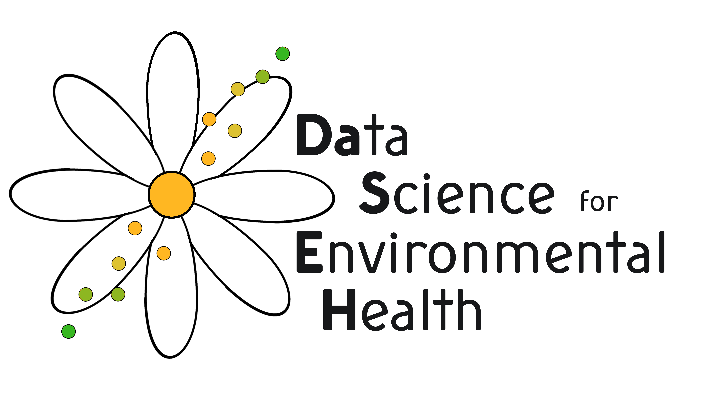
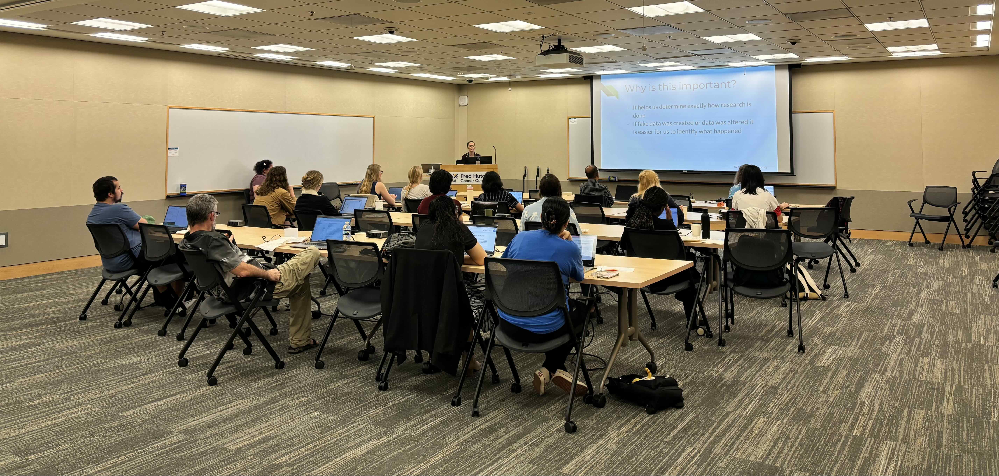

```{r setup, echo = FALSE, message = FALSE}
library(pander)
library(kableExtra)
library(tidyverse)
library(config)

knitr::opts_chunk$set(warning = FALSE, message = FALSE)
```

<!-- HTML Meta Tags -->

<title>Data Science for Environmental Health</title>

<meta name="DaSEH: NIEHS Short Course" content="">

<!-- Facebook Meta Tags -->

<!-- <meta property="url" content="https://daseh.org"> -->

<!-- <meta property="type" content="website"> -->

<!-- <meta property="title" content="NIEHS-Funded Short Course: Data Science for Environmental Health"> -->

<!-- <meta property="image" content="https://github.com/fhdsl/DaSEH/blob/main/images/DaSEH_logo_white.png?raw=true"> -->

<meta property="og:title" content="NIEHS-Funded Short Course: Data Science for Environmental Health" />

<meta property="og:type" content="website" />

<meta property="og:url" content="https://daseh.org" />

<meta property="og:image" content="https://github.com/fhdsl/DaSEH/blob/main/images/DaSEH_logo_white.png?raw=true" />

<!-- Meta Tags Generated via https://www.opengraph.xyz -->

::: leaf
:::

------------------------------------------------------------------------

<div style="text-align: center;">

</div>

Data Science for Environmental Health (DaSEH) is a short course that combines **online** learning and an **in-person** project-focused intensive. DaSEH is tailored for beginners and novices in R programming, offering instruction on importing, wrangling, visualizing, and analyzing data. It provides hands-on training in using R for statistical computing, a widely-used open-source tool for data analysis and visualization.

This training initiative is funded by National Institute of Environmental Health Sciences [1R25ES035590-01](https://reporter.nih.gov/search/cMEAgQFeo025gUX1DDzH9g/project-details/10746327).

<br>

```{r, echo = FALSE, fig.alt = "DaSEH participants in person in a classroom learning about reproducibility.", out.width="100%"}

```

<br>

## Online course

------------------------------------------------------------------------

*`r config::get("online_dates")`*\
*`r config::get("online_times")`*

Two-week online course in R programming foundations.

<br>

## Codeathon

------------------------------------------------------------------------

*`r config::get("codeathon_dates")`*\
*`r config::get("codeathon_times")`*

Three-day in-person intensive “Codeathon”. Here, we'll work on authentic environmental health projects. We'll also practice data ethics skills in peer code review, reproducibility, and transparency in a supportive environment.

<br>

<!-- ## Sign Up! -->

<!-- *** -->

<!-- Please apply for the Fall Session using [this form](`r config::get("register_link")`) by **August 16, 2024**.  -->

<!-- You can reach out to daseh @ fredhutch.org with any questions. -->

<!-- <br> -->

## Testimonials from our other courses:

------------------------------------------------------------------------

"Thanks all for a wonderful course! I feel super confident in R now and I am excited to apply what we learned to future projects. Cheers !!"

"I feel like a data witch now! I just say poof and the data looks the way I want"

"OK - this is getting to be too much fun now"

"My 14 year old thinks this class looks cool and wants to take it (she's a wanna be engineer)"

<br><br><br>

This page was last updated on `r Sys.Date()`.

<br />
