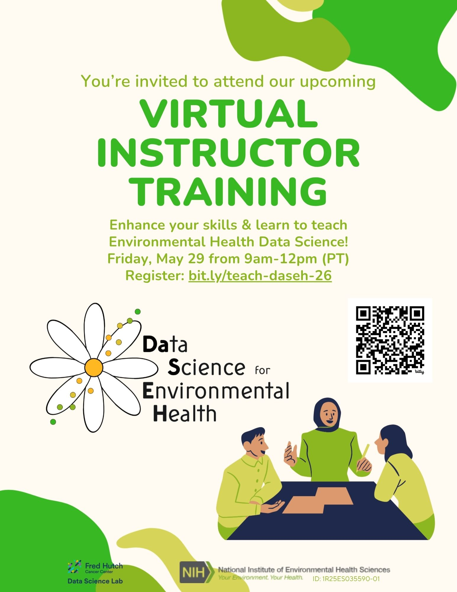

<div class="leaf"></div> 
# Instructor Training
***

```{r setup, echo = FALSE, message = FALSE}
library(pander)
library(kableExtra)
library(tidyverse)
library(config)

knitr::opts_chunk$set(warning = FALSE, message = FALSE)
```

<br>

```{r, echo = FALSE, fig.alt = "DaSEH participants in person in a classroom learning about reproducibility.", out.width="50%"}

```

<br>

Interested in teaching data science for environmental health? Join us for DaSEH's Virtual Instructor Training on May 29, 2026! This session is designed to prepare instructors to deliver DaSEH-related curriculum.

Virtual Instructor Training: **May 29; 9am – 12pm (PT) on Zoom.**

Register here: https://forms.gle/siJhkUgFVndNp4tX9. Zoom link will be provided to registrants.

After the training, instructors are welcome to attend the [full DaSEH short course](https://daseh.org/logistics.html) to see the curriculum in action. Please get in touch at **daseh@fredhutch.org** for more information on attending the full course.

<br>
<br>
<br>

<p style="text-align:center;"><a rel="license" href="http://creativecommons.org/licenses/by-nc-sa/4.0/"> </a> </p><br />
