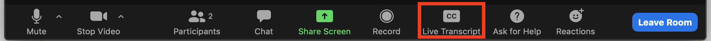
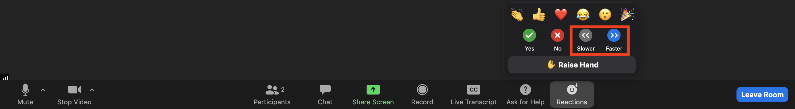
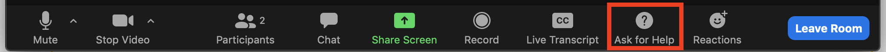

```{r setup, echo = FALSE, message = FALSE}
library(tidyverse)
```

<br>

## Overview

Data Science for Environmental Health (DaSEH) is a short course that combines **online** and **in-person** modalities to help professionals get the most out of this training. 

We focus on building R skills in the online portion of the course. When in-person, we focus on project skills, working with real datasets.

<br>

## Audience 

We have designed DaSEH for the following audience:

- Practitioners, professionals, or researchers in the environmental health space who want programming and data science skills
- Educators who want programming and data science skills with a focus on environmental health
- Practitioners, professionals, researchers, or advanced students from [Minority Serving Institutions](https://msiexchange.nasa.gov/pdf/2023-2024%20MSI%20List.pdf) or institutions without training opportunities like DaSEH.

We especially encourage participants to join who are [underrepresented in data and health sciences](https://grants.nih.gov/grants/guide/notice-files/NOT-OD-20-031.html).

<br>

## Learning Objectives

By the end of the course, learners should be comfortable:

- Reading data into R
- Recoding and manipulating data
- Using R add-on packages
- Making exploratory plots
- Performing basic statistical tests
- Understanding basic programming syntax
- Creating reproducible R documents
- Collaborating on and developing independent projects in environmental health data science

<br>

## Online Course Logistics

<br>

#### When

`r config::get("course_dates")`

- **Time:** `r config::get("course_time")`

<br>

#### Where

- Course lectures and labs will be online through Zoom
- Zoom link and Slack link will be emailed to students
- Communication will mainly occur through Slack

<br>

#### Format

- Each class will consist of 2 or 3 hour-long modules.
- Each module features a lecture and an R programming lab, where students apply the skills taught in the modules to real data in breakout rooms.
- Class sessions will be recorded and later posted.
- If you have a question not covered during class, please post it on Slack. This allows everyone to see it. If another student does not answer your question (which we encourage!), we will try to answer it within 24 hours. If you feel uncomfortable posting a question publicly, let a TA or instructor know your question and we will post it for you anonymously.
- To get the most out of this class, if possible, we suggest working virtually with a **large monitor or two screens**. This setup allows you to follow along on Zoom while also doing the hands-on coding.  
- <details><summary> <span style = "color: #5383bb;"> **Please click here for details about using Zoom.**</span></summary>

  Zoom + Working Virtually

  ***

  * Please be aware that there is the option to use closed captioning:

  

  * During lectures you can indicate how you feel about the pace of the course like so:

  

  * In breakout room sessions you can ask for help like so:

  

  * For directions on how to change breakout rooms click [here](https://docs.google.com/document/d/1YP1pZF1bIm66_Tl15Y3eHl8pGxNIASD33mKCtGCfQzc/edit?usp=sharing).

  ***
  </details>

<br>

## Course Evaluation

Course evaluations are very important for the school to determine what courses to continue to support. It also helps us to improve the course with your feedback. We will be using surveys throughout DaSEH to help make it a rewarding experience.

<br>

## Assignments

Homework is *strictly optional*. We encourage it to reinforce your learning.

<br>


<!-- ### Final Project -->

<!-- This project should entail: -->

<!-- - reading in a dataset of your choosing -->
<!-- - doing some light data cleaning -->
<!-- - performing some data summarization -->
<!-- - creating a couple of visualizations -->
<!-- - doing some very light statistical analysis, like regression or t-tests -->

<!-- You may use public datasets, or your own data for the project. If using your own dataset, **be sure any sensitive information is protected**. -->

<!-- Example projects can be found with the source code: [Rmd](modules/Project_Example/Project_Example.Rmd), and the output [html](modules/Project_Example/Project_Example.html) here. -->

<!-- See the [guidelines/instructions](modules/Project_Guidelines/Project_Guidelines.html) for final projects, including dataset resources. -->

<!-- <br> -->


## Code of Conduct

We would like to create an open, safe, welcoming, diverse, inclusive, intellectually stimulating, and hopefully fun class experience.

We strive to be a space in which individual differences are respected, so that each individual can reach their fullest potential.

**Please familiarize yourself with our Code of Conduct [here](https://daseh.org/resources/code_of_conduct.html).**

Quick Links:

- [Reporting Form](https://forms.gle/WBymAnzfWYpfWk4b6)
- [Fred Hutch Third Party - EthicsPoint](https://secure.ethicspoint.com/domain/media/en/gui/89211/index.html)

<br>
