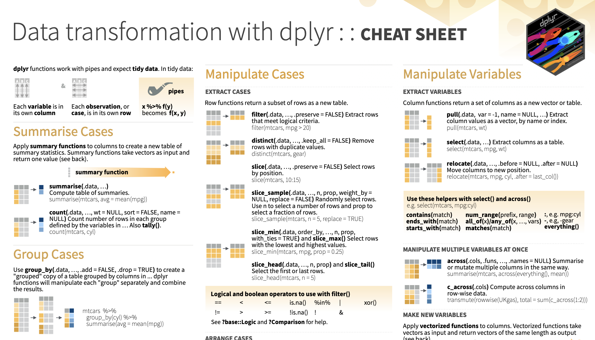

```{r, echo = FALSE, message=FALSE, error = FALSE}
library(knitr)
opts_chunk$set(comment = "", message = FALSE)
suppressWarnings({library(dplyr)})
library(readr)
library(tidyverse)
```

<style type="text/css">
pre { /* Code block - slightly smaller in this lecture */
    font-size: 20px;
}
</style>

## Recap

- `select()`: subset and/or reorder columns
- `filter()`: remove rows
- `arrange()`: reorder rows
- `mutate()`: create new columns or modify them
- `select()` and `filter()` can be combined together
- remove a column: `select()` with `!` mark (`!col_name`)
- you can do sequential steps: especially using pipes `%>%`

📃[Cheatsheet](https://daseh.org/modules/cheatsheets/Day-3.pdf)


## Another Cheatsheet

https://raw.githubusercontent.com/rstudio/cheatsheets/main/data-transformation.pdf

```{r, fig.alt="A preview of the Data transformation cheatsheet produced by RStudio.", out.width = "80%", echo = FALSE, align = "center"}

```


## Data Summarization

* Basic statistical summarization
    * `mean(x)`: takes the mean of x
    * `sd(x)`: takes the standard deviation of x
    * `median(x)`: takes the median of x
    * `quantile(x)`: displays sample quantiles of x. Default is min, IQR, max
    * `range(x)`: displays the range. Same as `c(min(x), max(x))`
    * `sum(x)`: sum of x
    * `max(x)`: maximum value in x
    * `min(x)`: minimum value in x
    
* **all have the ** `na.rm =` **argument for missing data**


## Statistical summarization

The vector getting summarized goes inside the parentheses:

```{r}
x <- c(1, 5, 7, 4, 2, 8)
mean(x)
range(x)
sum(x)
```


## Statistical summarization

Note that many of these functions have additional inputs regarding missing data, typically requiring the `na.rm` argument ("remove NAs"). 

```{r error = TRUE}
x <- c(1, 5, 7, 4, 2, 8, NA)
mean(x)
mean(x, na.rm = TRUE)
quantile(x)
quantile(x, na.rm = TRUE)
```


## Statistical summarization{.codesmall}

We will talk more about data types later, but you can only do summarization on numeric or logical types, NOT characters.

```{r error = TRUE}
x <- c(1, 5, 7, 4, 2, 8)
sum(x)
y <- c(TRUE, FALSE, FALSE, TRUE) # FALSE == 0 and TRUE == 1
sum(y)
z <- c("TRUE", "FALSE", "FALSE", "TRUE")
sum(z)
```


## Some examples

We can use the `CO_heat_ER` object from the `dasehr` package to explore different ways of summarizing data. (This dataset contains information about the number and rate of visits for heat-related illness to ERs in Colorado from 2011-2022, adjusted for age.)  The `head` command displays the first rows of an object:

```{r}
library(dasehr)
head(CO_heat_ER)
```


## The `dplyr` pipe `%>%` operator

A nice and readable way to chain together multiple R functions.

Changes `f(x, y)` to `x %>% f(y)`.

```{r eval=FALSE}
# Going to work
get_dressed(me,
            pack_lunch(
              check_pockets(
                wallet = TRUE, phone = TRUE, keys = TRUE),
              items = c("sandwich", "chips", "apple"), lunchbox = TRUE),
            pants = TRUE, shirt = TRUE, footwear = "sandals")

# Going to work, the tidy way
me %>%
  get_dressed(pants = TRUE, shirt = TRUE, footwear = "sandals") %>%
  pack_lunch(items = c("sandwich", "chips", "apple"), lunchbox = TRUE) %>%
  check_pockets(wallet = TRUE, phone = TRUE, keys = TRUE)
```


## Statistical summarization the "tidy" way

```{r}
CO_heat_ER %>% pull(visits) %>% mean(na.rm=T) # alt: pull(CO_heat_ER, visits) %>% mean(na.rm=T)
CO_heat_ER %>% pull(rate) %>% median(na.rm=T)
CO_heat_ER %>% pull(visits) %>% quantile(na.rm=T)
CO_heat_ER %>% pull(rate) %>% quantile(probs = 0.9, na.rm=T)
```


## Behavior of `pull()` function

`pull()` converts a single data column into a vector. This allows you to run summary functions on these data. Once you have "pulled" the data column out, you don't have to name it again in any piped summary functions.

```{r}
er_visits <- CO_heat_ER %>% pull(visits)
class(er_visits)
er_visits
```

```{r, eval=FALSE}
CO_heat_ER %>% pull(visits) %>% range(visits) # Incorrect
```

```{r}
CO_heat_ER %>% pull(visits) %>% range(na.rm=T) # Correct
```


# Summarization on tibbles (data frames)

## Historical CO2 emissions by country

Let's look at a dataset that tracks yearly estimated CO2 emissions by country. We will read it in as a `tibble`.

If you have the `dasehr` package installed successfully:

```{r}
library(dasehr)
yearly_co2 <- yearly_co2_emissions
```

<br>
If not, download the `csv` file from https://daseh.org/data/Yearly_CO2_Emissions_1000_tonnes.csv and read it in:

```{r eval = FALSE}
yearly_co2 <- 
  read_csv(file = "https://daseh.org/data/Yearly_CO2_Emissions_1000_tonnes.csv")
```

Check out the data:

```{r}
head(yearly_co2)
```

## Historical CO2 emissions by country

Check out the data:

```{r}
str(yearly_co2)
```


## CO2 Emissions

Before we go further, let's rename the second column using the `rename()` function in `dplyr`.

In this case, we will use the backticks (\`) because we will be referring to a column that has a numerical name. If there are funky spaces or characters in the column name, the backticks are required. 

```{r}
library(dplyr)
yearly_co2 <- yearly_co2 %>%
  rename(year1751 = `1751`)
```


## CO2 Emissions

`colnames()` will show us the column names and show that the `1751` column is renamed:

```{r}
colnames(yearly_co2)
```


## Summarize the data: `dplyr` `summarize()` function

`summarize` creates a summary table of a column you're interested in.

Can run multiple summary statistics at once (unlike `pull()` which can only do a single calculation on one column).

You can also do more elaborate summaries across different groups of data using `group_by()`. More on this later!

<div class = "codeexample">
```{r, eval = FALSE}
# General format - Not the code!
{data to use} %>% 
   summarize({summary column name} = {operator(source column)},
             {summary column name} = {operator(source column)}) 
```
</div>


## Summarize the data: `dplyr` `summarize()` function

`summarize` creates a summary table of a column you're interested in.

<div class = "codeexample">
```{r, eval = FALSE}
# General format - Not the code!
{data to use} %>% 
   summarize({summary column name} = {operator(source column)}) 
```
</div>

```{r}
yearly_co2 %>% 
  summarize(mean_1989 = mean(`1989`)) # Note the backticks, this is a column name!
yearly_co2 %>% 
  summarize(mean_1989 = mean(`1989`, na.rm = TRUE))
```


## Summarize the data: `dplyr` `summarize()` function

`summarize()` can do multiple operations at once. Just separate by a comma.

```{r}
yearly_co2 %>% 
  summarize(mean_1989 = mean(`1989`, na.rm = TRUE),
            median_1989 = median(`1989`, na.rm = TRUE),
            median(`2000`, na.rm = TRUE))
```

<br>
Notice how when we forget to provide a new name, output is still provided, but the column name is messy.


## Summarize the data: `dplyr` `summarize()` function

This looks better.

```{r}
yearly_co2 %>% 
  summarize(mean_1989 = mean(`1989`, na.rm = TRUE),
            median_1989 = median(`1989`, na.rm = TRUE),
            median_2000 = median(`2000`, na.rm = TRUE))
```


## Summarize the data: `dplyr` `summarize()` function

Note that `summarize()` creates a separate tibble from the original data, so you don't want to overwrite your original data if you decide to save the summary.

If you want to save a summary statistic in the original data, use `mutate()` instead to create a new column for the summary statistic.


## `summary()` Function

Using `summary()` can give you rough snapshots of each numeric column (character columns are skipped):

```{r}
summary(yearly_co2)
```


## Summary & Lab Part 1

- summary stats (`mean()`) work with `pull()`
- don't forget the `na.rm = TRUE` argument!
- `summary(x)`: quantile information
- `summarize`: creates a summary table of columns of interest

🏠 [Class Website](https://daseh.org/)

💻 [Lab](https://daseh.org/modules/Data_Summarization/lab/Data_Summarization_Lab.Rmd)


## CO ER Heat Illness Visits

Let's go back to the dataset of CO ER visits for heat-related illness. Remember, we loaded this data into our session and saved it as the object `CO_heat_ER`.

```{r}
head(CO_heat_ER)
```


## `distinct()` values

`distinct(x)` will return the unique elements of column `x`.

```{r, message = FALSE}
CO_heat_ER %>%
  distinct(county)
```


## How many `distinct()` values?

`n_distinct()` tells you the number of unique elements. _Must pull the column first!_

```{r}
CO_heat_ER %>%
  pull(county) %>% 
  n_distinct()
```


```{r echo=FALSE}
options(max.print = 1000)
```


## `dplyr`: `count` 

Use `count` to return a frequency table of unique elements of a data.frame.

```{r, message = FALSE}
CO_heat_ER %>% count(county)
```


## `dplyr`: `count` 

Multiple columns listed further subdivides the count.

```{r, message = FALSE}
CO_heat_ER %>% count(county, gender)
```

<br>

**Note:** `count()` includes NAs


# Grouping

## Perform Operations By Groups: dplyr

`group_by` allows you group the data set by variables/columns you specify:

```{r}
# Regular data
CO_heat_ER
```


## Perform Operations By Groups: dplyr

`group_by` allows you group the data set by variables/columns you specify:

```{r}
CO_heat_ER_grouped <- CO_heat_ER %>% group_by(gender)
CO_heat_ER_grouped
```


## Summarize the grouped data

It's grouped! Grouping doesn't change the data in any way, but how **functions operate on it**. Now we can summarize `Data_Value` (percent of respondents) by group:

```{r}
CO_heat_ER_grouped %>% summarize(avg_visits = mean(visits, na.rm = TRUE))
```


## Use the `pipe` to string these together!

Pipe `yts` into `group_by`, then pipe that into `summarize`:

```{r}
CO_heat_ER %>%
  group_by(gender) %>%
  summarize(avg_visits = mean(visits, na.rm = TRUE),
            max_visits = max(visits, na.rm = TRUE))
```


## Group by as many variables as you want

`group_by` Response and Education:

```{r}
CO_heat_ER %>%
  group_by(gender, year) %>%
  summarize(avg_visits = mean(visits, na.rm = TRUE),
            max_visits = max(visits, na.rm = TRUE))
```


## Only the last `group_by` is recognized...

You can overwrite the first `group_by` with a new one.

```{r}
CO_heat_ER %>% 
  group_by(gender, year)  %>% 
  group_by(year) 
```


## Ungroup the data

The `ungroup` function will allow you to clear the groups from the data.

```{r}
CO_heat_ER <- ungroup(CO_heat_ER)
CO_heat_ER
```


## `group_by` with `mutate` - just add data

We can also use `mutate` to calculate the mean value for each year and add it as a column:

```{r}
CO_heat_ER %>%
  group_by(year, gender) %>%
  mutate(visits_year_avg = mean(visits, na.rm = TRUE)) %>%
  select(county, visits, visits_year_avg)
```


## Counting

There are other functions, such as `n()` count the number of observations (NAs included).

```{r}
CO_heat_ER %>%
  group_by(year) %>%
  summarize(n = n(),
            mean = mean(visits, na.rm = TRUE))
```


## Counting{.codesmall}

`count()` and `n()` can give very similar information.

```{r}
CO_heat_ER %>% count(county)
CO_heat_ER %>% group_by(county) %>% summarize(n()) # n() typically used with summarize
```


# A few miscellaneous topics .. 


## Base R functions you might see: `length` and `unique`

These functions require a column as a vector using `pull()`.

```{r, message = FALSE}
CO_heat_ER_loc <- CO_heat_ER %>% pull(county) # pull() to make a vector
CO_heat_ER_loc %>% unique() # similar to distinct()
```

## Base R functions you might see: `length` and `unique`

These functions require a column as a vector using `pull()`.

```{r, message = FALSE}
CO_heat_ER_loc %>% unique() %>% length() # similar to n_distinct()
```

## * New! * Many dplyr functions now have a `.by=` argument

Pipe `CO_heat_ER` into `group_by`, then pipe that into `summarize`:

```{r eval = FALSE}
CO_heat_ER %>%
  group_by(county) %>%
  summarize(avg_visits = mean(visits, na.rm = TRUE),
            max_visits = max(visits, na.rm = TRUE))
```

is the same as..

```{r eval = FALSE}
CO_heat_ER %>%
  summarize(avg_visits = mean(visits, na.rm = TRUE),
            max_visits = max(visits, na.rm = TRUE),
            .by = county)
```


## `summary()` vs. `summarize()`

* `summary()` (base R) gives statistics table on a dataset. 
* `summarize()` (dplyr) creates a more customized summary tibble/dataframe.

## Summary & Lab Part 2

- `count(x)`: what unique values do you have? 
  - `distinct()`: what are the distinct values?
  - `n_distinct()` with `pull()`: how many distinct values?
- `group_by()`: changes all subsequent functions
  - combine with `summarize()` to get statistics per group
  - combine with `mutate()` to add column
- `summarize()` with `n()` gives the count (NAs included) 

🏠 [Class Website](https://daseh.org/)

💻 [Lab](https://daseh.org/modules/Data_Summarization/lab/Data_Summarization_Lab.Rmd)

```{r, fig.alt="The End", out.width = "50%", echo = FALSE, fig.align='center'}
knitr::include_graphics(here::here("images/the-end-g23b994289_1280.jpg"))
```

Image by <a href="https://pixabay.com/users/geralt-9301/?utm_source=link-attribution&amp;utm_medium=referral&amp;utm_campaign=image&amp;utm_content=812226">Gerd Altmann</a> from <a href="https://pixabay.com//?utm_source=link-attribution&amp;utm_medium=referral&amp;utm_campaign=image&amp;utm_content=812226">Pixabay</a>


# Extra Slides: More advanced summarization

## Data Summarization on data frames
 
* Statistical summarization across the data frame
    * `rowMeans(x)`: takes the means of each row of x
    * `colMeans(x)`: takes the means of each column of x
    * `rowSums(x)`: takes the sum of each row of x
    * `colSums(x)`: takes the sum of each column of x


## `rowMeans()` example

Get means for each row.

Let's see what the mean CO2 emissions is across years for each row (country):

```{r}
yearly_co2 %>%
  select(starts_with("year")) %>%
  rowMeans(na.rm = TRUE) %>%
  head(n = 5)

yearly_co2 %>%
  group_by(country) %>%
  summarize(mean = rowMeans(across(starts_with("year")), na.rm = TRUE)) %>%
  head(n = 5)
```


## `colMeans()` example

Get means for each column.

Let's see what the mean is across each column (year):

```{r}
yearly_co2 %>%
  select(starts_with("year")) %>%
  colMeans(na.rm = TRUE) %>%
  head(n = 5)

yearly_co2 %>%
  summarize(across(starts_with("year"), ~mean(.x, na.rm = TRUE)))
```
