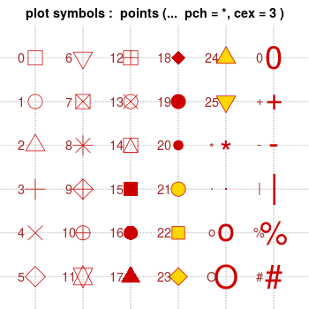

```{r knit-setup, echo=FALSE, include = FALSE}
library(knitr)
opts_chunk$set(echo = TRUE,
               message = FALSE,
               warning = FALSE,
               fig.height = 4,
               fig.width = 7,
               comment = "")
library(tidyverse)
library(tidyr)
install.packages('emoji', repos='http://cran.us.r-project.org', dependencies=TRUE)
library(emoji)
```

## Recap

-   `pivot_longer()` helps us take our data from wide to long format
    -   `names_to =` gives a new name to the pivoted columns\
    -   `values_to =` gives a new name to the values that used to be in those columns\
-   `pivot_wider()` helps us take our data from long to wide format
    -   `names_from` specifies the old column name that contains the new column names\
    -   `values_from` specifies the old column name that contains new cell values\
-   to merge/join data sets together need a variable in common - usually "id"

📃[Cheatsheet](https://daseh.org/modules/cheatsheets/Day-6.pdf)

## Recap continued

-   to merge/join data sets together need a variable in common - usually "id"
-   `?join` - see different types of joining for `dplyr`
-   `inner_join(x, y)` - only rows that match for `x` and `y` are kept
-   `full_join(x, y)` - all rows of `x` and `y` are kept
-   `left_join(x, y)` - all rows of `x` are kept even if not merged with `y`
-   `right_join(x, y)` - all rows of `y` are kept even if not merged with `x`
-   `anti_join(x, y)` - all rows from `x` not in `y` keeping just columns from `x`.
-   `esquisser()` function of the `esquisse` package can help make plot sketches

📃[Cheatsheet](https://daseh.org/modules/cheatsheets/Day-6.pdf)

## `esquisse` and `ggplot2`

```{r, fig.alt="esquisse", out.width = "28%", echo = FALSE, fig.show='hold',fig.align='center'}
knitr::include_graphics("https://pbs.twimg.com/media/DoaBCAwWsAEaz-y.png")
```

```{r, fig.alt="ggplot2", out.width = "19%", echo = FALSE, fig.show='hold',fig.align='center'}
knitr::include_graphics("https://d33wubrfki0l68.cloudfront.net/2c6239d311be6d037c251c71c3902792f8c4ddd2/12f67/css/images/hex/ggplot2.png")

```

## Why learn ggplot2?

More customization:

-   branding
-   making plots interactive
-   combining plots

Easier plot automation (creating plots in scripts)

Faster (eventually)

## ggplot2

-   A package for producing graphics - gg = *Grammar of Graphics*

-   Created by Hadley Wickham in 2005

-   Belongs to "Tidyverse" family of packages

-   *"Make a ggplot"* = Make a plot with the use of ggplot2 package

Resources:

-   <https://ggplot2-book.org/>

-   <https://www.opencasestudies.org/>

## ggplot2

Based on the idea of:

::: {style="color: red;"}
layering
:::

plot objects are placed on top of each other with `+`

📉 +\
📈

## ggplot2

```{r, fig.alt="ggplotcake", out.width = "90%", echo = FALSE, fig.show='hold',fig.align='center'}
knitr::include_graphics("img/cake.png")
```

Slide Credit: Tanya Shapiro

## ggplot2

-   Pros: extremely powerful/flexible -- allows combining multiple plot elements together, allows high customization of a look, many resources online

-   Cons: ggplot2-specific "grammar of graphic" of constructing a plot

-   [ggplot2 gallery](https://www.r-graph-gallery.com/ggplot2-package.html)

## Tidy data

To make graphics using `ggplot2`, our data needs to be in a **tidy** format

**Tidy data**:

1.  Each variable forms a column.
2.  Each observation forms a row.

Messy data:

-   Column headers are values, not variable names.
-   Multiple variables are stored in one column.
-   Variables are stored in both rows and columns.

## Tidy data: example

Ideally we want each variable as a column and we want each observation in a row.

Column headers are values, not variable names:

```{r, echo = FALSE, fig.align='center', out.width="80%"}

```

## Now the the data is "tidy" and in long format

```{r, echo = FALSE, fig.align='center'}

```

Read more about tidy data and see other examples: [Tidy Data](https://vita.had.co.nz/papers/tidy-data.pdf) tutorial

## Data to plot

Let's plot the CO heat-related ER visits dataset we've been working with. First, we'll only consider data from Boulder county.

Is the data in tidy? Is it in long format?

```{r}

er <- 
  read_csv("https://daseh.org/data/CO_ER_heat_visits.csv")
er_Boulder <- er %>% filter(county == "Boulder")

head(er_Boulder)
```

# First plot with `ggplot2` package

## First layer of code with `ggplot2` package

Will set up the plot - it will be empty!

```{r, echo = FALSE, fig.align='center'}

```

## First layer of code with `ggplot2` package

-   **Aesthetic mapping** `aes(x= , y =)` describes how variables in our data are mapped to elements of the plot - Note you don't need to use `mapping` but it is helpful to know what we are doing.

::: codeexample
```{r, eval = FALSE, class.source = "codeexample"}
library(ggplot2) # don't forget to load ggplot2
# This is not code but shows the general format
ggplot({data_to plot}, aes(x = {var in data to plot},
                                      y = {var in data to plot}))
```
:::

```{r, fig.width=3, fig.height=2.5, fig.align='center', class.source = "codereg"}
ggplot(er_Boulder, aes(x = year, y = rate))
```

## Next layer code with `ggplot2` package

```{r, echo = FALSE, fig.align='center', out.width = "35%"}

```

There are many to choose from, to list just a few:

-   `geom_point()` -- points (we have seen)
-   `geom_line()` -- lines to connect observations
-   `geom_boxplot()` -- boxplots
-   `geom_histogram()` -- histogram
-   `geom_bar()` -- bar plot
-   `geom_col()` -- column plot
-   `geom_tile()` -- blocks filled with color

## Next layer code with `ggplot2` package

When to use what plot? A few examples:

-   a scatterplot (`geom_point()`): to examine the relationship between two sets of continuous numeric data
-   a barplot (`geom_bar()`): to compare the distribution of a quantitative variable (numeric) between groups or categories
-   a histogram (`geom_hist()`): to observe the overall distribution of numeric data
-   a boxplot (`geom_boxplot()`): to compare values between different factor levels or categories

## Next layer code with `ggplot2` package

Need the `+` sign to add the next layer to specify the type of plot

::: codeexample
```{r, eval = FALSE, class.source = "codeexample"}

ggplot({data_to plot}, aes(x = {var in data to plot},
                                      y = {var in data to plot})) +
  geom_{type of plot}</div>
```
:::

```{r, fig.width=4, fig.height=3, fig.align='center'}
ggplot(er_Boulder, aes(x = year, y = rate)) +
  geom_point()
```

Read as: *using CO statewide ER heat visits data, and provided aesthetic mapping, add points to the plot*

## Tip - plus sign `+` must come at end of line

Having the + sign at the beginning of a line will not work!

```{r, eval = FALSE}
ggplot(er_Boulder, aes(x = year,
                           y = rate,
                           fill = item_categ))  
 + geom_boxplot()
```

Pipes will also not work in place of `+`!

```{r,eval = FALSE}
ggplot(er_Boulder, aes(x = year,
                           y = rate,
                           fill = item_categ))  %>%
geom_boxplot()
```

## Plots can be assigned as an object {.mall}

```{r, fig.width=4, fig.height=3, fig.align='center'}
plt1 <- ggplot(er_Boulder, aes(x = year, y = rate)) +
          geom_point()

plt1
```

## Examples of different geoms

```{r, fig.show="hold", out.width="40%"}
plt1 <- ggplot(er_Boulder, aes(x = year, y = rate)) +
          geom_point()

plt2 <- ggplot(er_Boulder, aes(x = year, y = rate)) +
          geom_line()

plt1 # fig.show = "hold" makes plots appear
plt2 # next to one another in the chunk settings
```

## Specifying plot layers: combining multiple layers

Layer a plot on top of another plot with `+`

```{r, fig.width=4, fig.height=3, fig.align='center'}
ggplot(er_Boulder, aes(x = year, y = rate)) +
  geom_point() +
  geom_line()
```

## Adding color - can map color to a variable
Let's map ER visit rates for four CO counties on the same plot

```{r, fig.width=4, fig.height=3, fig.align='center'}

er_visits_4 <- er %>% 
  filter(county %in% c("Denver", "Weld", "Pueblo", "Jackson"))

ggplot(er_visits_4, aes(x = year, y = rate, color = county)) +
  geom_point() +
  geom_line()
```

<!-- ## Adding color - or change the color of each plot layer -->

<!-- You can change look of each layer separately. Note the arguments like `linetype` and `alpha` that allow us to change the opacity of the points and style of the line respectively.  -->

<!-- ```{r, fig.width=5, fig.height=3, fig.align='center'} -->
<!-- ggplot(er_state, aes(x = year, y = rate)) + -->
<!--   geom_point(size = 5, color = "red", alpha = 0.5) + -->
<!--   geom_line(size = 0.8, color = "black", linetype = 2) -->
<!-- ``` -->

<!-- `linetype` can be given as a number. See the docs for what numbers correspond to what `linetype`! -->

# Customize the look of the plot

```{r, echo = FALSE, fig.align='center', out.width= "50%"}

```

## Customize the look of the plot {.codesmall}

You can change the look of whole plot using [`theme_*()` functions](https://ggplot2.tidyverse.org/reference/ggtheme.html).

There are also `size`, `color`, `alpha`, and `linetype` arguments.

```{r, fig.width=5, fig.height=3, fig.align='center'}
ggplot(er_Boulder, aes(x = year, y = rate)) +
  geom_point(size = 5, color = "green", alpha = 0.5) +
  geom_line(size = 0.8, color = "blue", linetype = 2) +
  theme_dark()
```

## More themes!

There's not only the built in ggplot2 themes but all kinds of themes from other packages!
- [ggthemes](https://jrnold.github.io/ggthemes/)
- [ThemePark package](https://github.com/MatthewBJane/ThemePark)
- [hrbr themes](https://github.com/hrbrmstr/hrbrthemes)

<!-- ## Customize the look of the plot -->

<!-- You can change the look of whole plot - **specific elements, too** - like changing [font](http://www.cookbook-r.com/Graphs/Fonts/) and font size - or even more [fonts](https://blog.revolutionanalytics.com/2012/09/how-to-use-your-favorite-fonts-in-r-charts.html) -->

<!-- ```{r, fig.width=6, fig.height=3.5, fig.align='center'} -->
<!-- ggplot(er_state, aes(x = year, y = rate)) + -->
<!--   geom_point(size = 5, color = "green", alpha = 0.5) + -->
<!--   geom_line(size = 0.8, color = "blue", linetype = 2) + -->
<!--   theme_bw() + -->
<!--   theme(text=element_text(size=16,  family="Comic Sans MS")) -->
<!-- ``` -->

## Adding labels {.codesmall}

The `labs()` function can help you add or modify titles on your plot. The `title` argument specifies the title. The `x` argument specifies the x axis label. The `y` argument specifies the y axis label.

```{r, fig.width=4, fig.height=2.5, fig.align='center'}
ggplot(er_Boulder, aes(x = year, y = rate)) +
            geom_point(size = 5, color = "red", alpha = 0.5) +
            geom_line(size = 0.8, color = "brown", linetype = 2) +
            labs(title = "Heat-Related ER Visits:Boulder",
              x = "Year",
              y = "Age-adjusted Visit Rate")
```

<!-- ## Adding labels line break {.codesmall} -->

<!-- Line breaks can be specified using `\n` within the `labs()` function to have a label with multiple lines. -->

<!-- ```{r, fig.width=4, fig.height=2.5, fig.align='center'} -->
<!-- ggplot(er_state, aes(x = year, y = rate)) + -->
<!--             geom_point(size = 5, color = "red", alpha = 0.5) + -->
<!--             geom_line(size = 0.8, color = "brown", linetype = 2) +  -->
<!--   labs(title = "My plot of Heat-Related ER Visits in CO: \n age-adjusted visit rate by year", -->
<!--               x = "Year", -->
<!--               y = "Age-adjusted Visit Rate") -->
<!-- ``` -->

## Changing axis: specifying axis scale {.codesmall}

`scale_x_continuous()` and `scale_y_continuous()` can change how the axis is plotted. Can use the `breaks` argument to specify how you want the axis ticks.

```{r, fig.height=2.5, fig.align='center'}
plot_scale <- ggplot(er_Boulder, aes(x = year, y = rate)) + 
                geom_point(size = 5, color = "green", alpha = 0.5) + 
                geom_line(size = 0.8, color = "blue", linetype = 2) +
                scale_x_continuous(breaks = seq(from = 2011, to = 2022, by = 1))
plot_scale
```

<!-- ## Changing axis: specifying axis limits -->

<!-- `xlim()` and `ylim()` can specify the limits for each axis -->

<!-- ```{r, fig.width=5, fig.height=3, fig.align='center'} -->

<!-- ggplot(er_state, aes(x = year, y = rate)) + -->
<!--             geom_point(size = 5, color = "green", alpha = 0.5) + -->
<!--             geom_line(size = 0.8, color = "blue", linetype = 2) +  -->
<!--   labs(title = "My plot of Heat-Related ER Visits in CO", -->
<!--               x = "Year", -->
<!--               y = "Age-adjusted Visit Rate") + -->
<!--   ylim(0, max(pull(er_visits_4, rate))) -->

<!-- ``` -->


## Modifying plot objects {.codesmall}

You can add to a plot object to make changes! Note that we can save our plots as an object like `plt1` below. And now if we reference `plt1` again our plot will print out!

```{r, fig.width=5, fig.height=3, fig.align='center'}
plt1 <- ggplot(er_Boulder, aes(x = year, y = rate,)) +
            geom_point(size = 5, color = "green", alpha = 0.5) +geom_line(size = 0.8, color = "blue", linetype = 2) + 
  labs(title = "Heat-Related ER Visits:Boulder", x = "Year", y = "Age-adjusted Visit Rate")

plt1 + theme_minimal()
```

## Removing the legend label

You can use `theme(legend.position = "none")` to remove the legend.

```{r, fig.width=5, fig.height=3, fig.align='center'}

er_visits_4 %>% ggplot(aes(x = year,
                      y = rate,
                      color = county)) +
  geom_line(size = 0.8) +
  theme(legend.position = "none")
```


## Overwriting specifications

It's possible to go in and change specifications with newer layers. Here is our original plot.

```{r, fig.width=5, fig.height=3, fig.align='center'}
er_visits_4 %>% ggplot(aes(x = year,
                      y = rate,
                      color = county)) +
  geom_line(size = 0.8)
```


## Overwriting specifications

It's possible to go in and change specifications with newer layers.

```{r, fig.width=5, fig.height=3, fig.align='center'}
er_visits_4 %>% ggplot(aes(x = year,
                      y = rate,
                      color = county)) +
  geom_line(size = 0.8, color = "black")
```


## Summary

-   `ggplot()` specifies what data use and what variables will be mapped to where
-   inside `ggplot()`, `aes(x = , y = , color =)` specify what variables correspond to what aspects of the plot in general
-   layers of plots can be combined using the `+` at the **end** of lines
-   special [`theme_*()` functions](https://ggplot2.tidyverse.org/reference/ggtheme.html) can change the overall look
-   individual layers can be customized using arguments like: `size`, `color` `alpha` (more transparent is closer to 0), and `linetype`
-   labels can be added with the `labs()` function and `x`, `y`, `title` arguments
<!-- -   the `\n` can be used for line breaks -->
<!-- -   `xlim()` and `ylim()` can limit or expand the plot area -->
-   `scale_x_continuous()` and `scale_y_continuous()` can modify the scale of the axes
-   by default, `ggplot()` removes points with missing values from plots.

## GUT CHECK: If we get an empty plot what might we need to do?

A. Add a `plot_` layer like `plot_point()`

B. Add a `geom_` layer like `geom_point()`


## GUT CHECK: How do we add more layers in ggplot2 plots?

A. `%>%`

B. `&`

C. `+`

## Lab 1

🏠 [Class Website](https://daseh.org/)
💻 [Lab](https://daseh.org/modules//Data_Visualization/lab/Data_Visualization_Lab.Rmd) 
📃[Day 6 Cheatsheet](https://daseh.org/modules/cheatsheets/Day-6.pdf)

## theme() function:

The `theme()` function can help you modify various elements of your plot. Here we will adjust the font size of the plot title.

```{r, fig.width=5, fig.height=3, fig.align='center'}
ggplot(er_Boulder, aes(x = year, y = rate)) +
            geom_point(size = 5, color = "green", alpha = 0.5) +
            geom_line(size = 0.8, color = "blue", linetype = 2) + 
  labs(title = "Heat-Related ER Visits:Boulder") +
  theme(plot.title = element_text(size = 20))

```

## theme() function

The `theme()` function always takes:

1.  an object to change (use `?theme()` to see - `plot.title`, `axis.title`, `axis.ticks` etc.)
2.  the aspect you are changing about this: `element_text()`, `element_line()`, `element_rect()`, `element_blank()`
3.  what you are changing:
    -   text: `size`, `color`, `fill`, `face`, `alpha`, `angle`
    -   position: `"top"`, `"bottom"`, `"right"`, `"left"`, `"none"`
    -   rectangle: `size`, `color`, `fill`, `linetype`
    -   line: `size`, `color`, `linetype`

## theme() function: center title and change size

The `theme()` function can help you modify various elements of your plot. Here we will adjust the horizontal justification (`hjust`) of the plot title.

```{r, fig.width=5, fig.height=3, fig.align='center'}
ggplot(er_Boulder, aes(x = year, y = rate)) +
            geom_point(size = 5, color = "green", alpha = 0.5) +
            geom_line(size = 0.8, color = "blue", linetype = 2) + 
  labs(title = "Heat-Related ER Visits:Boulder") +

  theme(plot.title = element_text(hjust = 0.5, size = 20))

```

## theme() function: change title and axis format

```{r, fig.width=5, fig.height=3, fig.align='center'}
ggplot(er_Boulder, aes(x = year, y = rate)) +
            geom_point(size = 5, color = "green", alpha = 0.5) +
            geom_line(size = 0.8, color = "blue", linetype = 2) + 
  labs(title = "Heat-Related ER Visits: Boulder") +
  theme(plot.title = element_text(hjust = 0.5, size = 20),
        axis.title = element_text(size = 16))
```

<!-- ## theme() function: moving (or removing) legend {.codesmall} -->

<!-- If specifying position - use: "top", "bottom", "right", "left", "none" -->

<!-- ```{r, fig.show="hold", out.width="40%"} -->
<!-- ggplot(er_visits_4, aes(x = year, y = rate, color = county)) + -->
<!--   geom_line() -->

<!-- ggplot(er_visits_4, aes(x = year, y = rate, color = county)) + -->
<!--   geom_line() + -->
<!--   theme(legend.position = "bottom") -->
<!-- ``` -->

## Cheatsheet about theme

<https://github.com/claragranell/ggplot2/blob/main/ggplot_theme_system_cheatsheet.pdf>

```{r, echo = FALSE, fig.align='center', out.width= "55%"}

```

<!-- ## Keys for specifications -->

<!-- `linetype` -->

<!-- ```{r, echo = FALSE, fig.align='center', out.width= "60%"} -->
<!-- knitr::include_graphics("img/line_types.png") -->
<!-- ``` -->

<!-- [source](http://www.cookbook-r.com/Graphs/Shapes_and_line_types/figure/line_types-1.png) -->

<!-- ## Linetype key -->

<!-- -   *geoms* that draw lines have a `linetype` parameter -->
<!-- -   these include values that are strings like "blank", "solid", "dashed", "dotdash", "longdash", and "twodash" -->

<!-- ```{r, fig.width=5, fig.height=3, fig.align='center'} -->
<!-- er_state %>% ggplot(aes(x = year, -->
<!--                       y = rate)) + -->
<!--   geom_line(size = 0.8, linetype = "twodash") -->
<!-- ``` -->


<!-- ## Keys for specifications -->

<!-- `shape` -->

<!-- ```{r, echo = FALSE, fig.align='center', out.width= "50%"} -->
<!--  -->
<!-- ``` -->

<!-- [source](http://www.cookbook-r.com/Graphs/Shapes_and_line_types/figure/unnamed-chunk-2-1.png) -->

<!-- ## shape key -->

<!-- -   *geoms* that draw have points have a `shape` parameter -->
<!-- -   these include numeric values (don't need quotes for these) and some characters values (need quotes for these) -->


<!-- ```{r, fig.width=5, fig.height=3, fig.align='center'} -->
<!-- er_state %>% ggplot(aes(x = year, -->
<!--                       y = rate)) + -->
<!--   geom_point(size = 2, shape = 12) -->
<!-- ``` -->


<!-- ## Can make your own theme to use on plots! -->

<!-- Guide on how to: <https://rpubs.com/mclaire19/ggplot2-custom-themes> -->


<!-- ## Group and/or color by variable's values -->

<!-- Let's work with two slightly different versions of the CO ER visits dataset. We used the first one, `er_visits_4`, a little earlier in this lecture. This dataset includes county-level data on the number of visits to the ER for heat-related illness, as well as the age-adjusted rate and the 95% confidence bounds. The dataset includes: -->

<!-- -   17 different CO counties (plus the statewide data) -->
<!-- -   12 different years  -->

<!-- We can also work with a dataset which we'll call `er_visits_gender`. This dataset contains the number of visits to the ER for heat-related illnesses, as well as the age-adjusted rate and the 95% confidence bounds around the rate, for: -->

<!-- -   two genders (male, female) -->
<!-- -   9 different CO counties (plus the statewide data) -->
<!-- -   12 different years  -->


## Starting a plot

Let's start with `er_visits_4`.

```{r, fig.width=5, fig.height=3, fig.align='center'}
ggplot(er_visits_4, aes(x = year,
                 y = rate)) +
  geom_line()
```

## If it looks confusing to you, try again

```{r, echo = FALSE, fig.align='center', out.width= "30%"}
knitr::include_graphics("https://media.giphy.com/media/xT0xeuOy2Fcl9vDGiA/giphy.gif")
```

## Using `group` in plots

You can use `group` element in a mapping to indicate that each `county` will have a rate line.

```{r, fig.width=5, fig.height=3, fig.align='center'}
ggplot(er_visits_4, aes(x = year,
                           y = rate,
                           group = county)) +
  geom_line()
```

## Adding color will automatically group the data

```{r, fig.width=5, fig.height=3, fig.align='center'}
ggplot(er_visits_4, aes(x = year,
                           y = rate,
                       color = county)) +
  geom_line()+
  theme(legend.position = "bottom")
```


## Tips!

Let's talk additional tricks and tips for making ggplots!


## Tips - Color vs Fill {.codesmall}

-   `color` is needed for points and lines
-   `fill` is generally needed for boxes and bars

```{r, out.width="30%", fig.show='hold'}
ggplot(er_visits_4, aes(x = county,
                 y = visits,
                 color = county)) + #color creates an outline
  geom_boxplot()

ggplot(er_visits_4, aes(x = county,
                 y = rate,
                 fill = county)) + # fills the boxplot
  geom_boxplot()
```

## Tip - Good idea to add jitter layer to top of box plots

Can add `width` argument to make the jitter more narrow.

```{r, fig.width=5 , fig.height=3, fig.align='center'}
ggplot(er_visits_4, aes(x = county,
                 y = rate,
                 fill = county)) +
  geom_boxplot() +
  geom_jitter(width = .06)
```

## Tip - be careful about colors for color vision deficiency

`scale_fill_viridis_d()` for discrete /categorical data `scale_fill_viridis_c()` for continuous data

```{r, fig.width=5 , fig.height=3, fig.align='center'}
ggplot(er_visits_4, aes(x = county,
                 y = rate,
                 fill = county)) +
  geom_boxplot() +
  geom_jitter(width = .06) +
  scale_fill_viridis_d()
```

## Tip - can pipe data after wrangling into ggplot()

```{r, fig.width=5 , fig.height=2.5, fig.align='center'}

er_bar <- er_visits_4 %>%
  group_by(county) %>%
  summarize("max_rate" = max(rate, na.rm=T)) %>%

ggplot(aes(x = county,
           y = max_rate,
           fill = county)) +
  scale_fill_viridis_d()+
  geom_col() +
  theme(legend.position = "none")

er_bar
```

## Tip - color outside of `aes()`

Can be used to add an outline around column/bar plots.

```{r, fig.width=5 , fig.height=3, fig.align='center'}
er_bar +
   geom_col(color = "black")
```

## Tip - col vs bar {.codesmall}

`geom_bar(x =)` can only use one `aes` mapping `geom_col(x = , y = )` can have two

## Tip - Check what you plot {.codesmall}

`r emoji("warning")` May not be plotting what you think you are! `r emoji("warning")`

```{r, fig.width=5 , fig.height=3, fig.align='center'}
ggplot(er_visits_4, aes(x = county,
                 y = visits,
                 fill = county)) +
  geom_col()
```

## What did we plot? Always good to check it is correct! {.codesmall}

```{r}
head(er_visits_4, n = 3)

er_visits_4 %>% group_by(county) %>%
  summarize(sum = sum(visits, na.rm=T))
```

## Try that again {.codesmall}

```{r, fig.width=5 , fig.height=3, fig.align='center'}
er_visits_4 %>% group_by(county) %>%
  summarize(mean_visits = mean(visits, na.rm=T))
```

## Try that again {.codesmall}

```{r}
er_visits_4 %>% group_by(county) %>%
  summarize(mean_visits = mean(visits, na.rm=T)) %>%

ggplot(aes(x = county,
           y = mean_visits,
           fill = county)) +
  geom_col()
```

## Tip - make sure labels aren't too small

```{r, fig.width=5 , fig.height=3, fig.align='center'}
er_bar +
  theme(text = element_text(size = 20))

```

<!-- ## Tip- if you need you can remove outliers -->

<!-- Set `outlier.shape = NA` to get ride of outliers. Be careful about if you really should remove these! -->

<!-- However, if can be helpful if your plot is getting stretched to accommodate plotting an outlier. You can always say in the figure legend what you removed. -->

<!-- ```{r} -->
<!-- er_no_out1 <- ggplot(er_visits_gender, aes(y = visits, x = gender)) + -->
<!--   geom_boxplot() -->

<!-- er_no_out2 <- ggplot(er_visits_gender, aes(y = visits, x = gender)) + -->
<!--   geom_boxplot(outlier.shape = NA) + -->
<!--   ylim(0,40) -->
<!-- ``` -->

<!-- ```{r, fig.show="hold", out.width="40%", echo = FALSE} -->
<!-- er_no_out1 # fig.show = "hold" makes plots appear -->
<!-- er_no_out2 # next to one another in the chunk settings -->
<!-- ``` -->

<!-- ## NA Values {.codesmall} -->

<!-- -   if it is a numeric value it will just get dropped from the graph and you will see a warning -->
<!-- -   it is categorical you will see it on the graph and will need to filter to remove the NA category -->

<!-- ```{r} -->
<!-- icecream <-tibble(flavor = -->
<!--             rep(c("chocolate", "vanilla", NA,"chocolate", "vanilla"), 8)) -->

<!-- icecream1 <- ggplot(icecream, aes(x = flavor)) + geom_bar() + -->
<!--               theme(text=element_text(size=24)) -->

<!-- icecream2 <- icecream %>% drop_na(flavor)  %>% -->
<!--                 ggplot( aes(x = flavor)) + geom_bar() + -->
<!--                   theme(text=element_text(size=24)) -->
<!-- ``` -->

<!-- ```{r, fig.show="hold", out.width="30%", echo = FALSE} -->
<!-- icecream1 # fig.show = "hold" makes plots appear -->
<!-- icecream2 # next to one another in the chunk settings -->
<!-- ``` -->

## Sometimes we have many lines and it is hard to see what is happening{.codesmall}

Let's look at visit rates for 9 CO counties.

```{r, fig.width=5, fig.height=3, fig.align='center'}
er_visits_9 <- er %>% 
  filter(county %in% c("Denver", "Weld", "Pueblo", "Jackson", 
                       "San Juan", "Mesa", "Jefferson", "Larimer", "Boulder"))

lots_of_lines <- ggplot(er_visits_9, aes(x = year,
                 y = rate,
                 color = county)) +
                 geom_line()
lots_of_lines
```

## Adding a facet can help make it easier to see what is happening {.codesmall}

Sometimes we have two many lines and can git difficult to see what is happening, facets can help!

Two options: `facet_grid()`- creates a grid shape `facet_wrap()` -more flexible

Need to specify how you are faceting with the `~` sign.

```{r,  fig.align='center', eval = FALSE}

lots_of_lines +
facet_grid( ~ county) +
theme(legend.position = "bottom")

```

## Adding a facet can help make it easier to see what is happening

```{r, fig.width= 10, fig.align='center'}


lots_of_lines +
facet_grid( ~ county) +
theme(legend.position = "none") +
theme(axis.text.x = element_text(angle = 90))

```

## facet_wrap() {.codesmall}

-   more flexible - arguments `ncol` and `nrow` can specify layout
-   can have different scales for axes using `scales = "free"`

```{r, fig.height = 5, fig.align='center', echo= TRUE}

rp_fac_plot <- lots_of_lines +
               facet_wrap( ~ county, ncol = 4, scales = "free") +
               theme(legend.position = "none")
```

```{r, echo = FALSE, eval = TRUE}
rp_fac_plot <- lots_of_lines +
               facet_wrap( ~ county, ncol = 4, scales = "free") +
               theme(legend.position = "none")
```


```{r, fig.height = 3.5, fig.width = 10, fig.align='center', comment=FALSE}
rp_fac_plot
```

<!-- # Extensions -->

<!-- ## `directlabels` package -->

<!-- Great for adding labels directly onto plots <https://www.opencasestudies.org/ocs-bp-co2-emissions/> -->

<!-- ```{r, out.width="50%", fig.align="center"} -->
<!-- #install.packages("directlabels") -->
<!-- library(directlabels) -->
<!-- direct.label(lots_of_lines, method = list("angled.boxes")) -->
<!-- ``` -->

<!-- ## `patchwork` package -->

<!-- Great for combining plots together -->

<!-- Also check out the [`patchwork` package](https://patchwork.data-imaginist.com/) -->

<!-- ```{r, out.width= "50%", fig.align='center'} -->
<!-- #install.packages("patchwork") -->
<!-- library(patchwork) -->
<!-- (plt1 + plt2)/plt2 -->

<!-- ``` -->
<!-- ## `ggpubr` package -->

<!-- Great for adding p-values and significance levels <https://cran.r-project.org/web/packages/ggpubr/ggpubr.pdf>  -->

<!-- ```{r, out.width="50%", fig.align="center"} -->

<!-- install.packages("ggpubr") -->

<!-- library(ggpubr) -->

<!-- data("ToothGrowth") -->

<!-- ggboxplot(ToothGrowth, x = "dose", y = "len", -->

<!--           color = "dose", palette = "jco")+ -->

<!--   stat_compare_means(method = "anova") -->

<!-- ``` -->

## plotly

```{r}
#install.packages("plotly")
library(plotly) # creates interactive plots!
ggplotly(lots_of_lines)
```

Also check out the [`ggiraph` package](https://www.rdocumentation.org/packages/ggiraph/versions/0.6.1)

## `patchwork` package

Great for combining plots together

Also check out the [`patchwork` package](https://patchwork.data-imaginist.com/)

```{r, out.width= "80%", fig.align='center'}
#install.packages("patchwork")
library(patchwork)
lots_of_lines + rp_fac_plot

```

# Saving plots

## Saving a ggplot to file

A few options:

-   RStudio \> Plots \> Export \> Save as image / Save as PDF
-   RStudio \> Plots \> Zoom \> [right mouse click on the plot] \> Save image as
-   In the code

```{r, eval = FALSE}
ggsave(filename = "saved_plot.png",  # will save in working directory
       plot = rp_fac_plot,
       width = 6, height = 3.5)               # by default in inches
```

## GUT CHECK: How to we make sure that the boxplots are filled with color instead of just the outside boarder?

A. Use the `fill` argument in the `aes` specification 

B. Use `color` argument in `geom_boxplot()`

## GUT CHECK: If our plot is too complicated to read, what might be a good option to fix this?

A. add more `theme()` layers

B. Use `facet_grid()` to split the plot up


## Summary

-   The `theme()` function helps you specify aspects about your plot
    -   move or remove a legend with `theme(legend.position = "none")`
    -   change font aspects of individual text elements `theme(plot.title = element_text(size = 20))`
    -   center a title: `theme(plot.title = element_text(hjust = 0.5))`
-   sometimes you need to add a `group` element to `aes()` if your plot looks strange
-   make sure you are plotting what you think you are by checking the numbers!
-   `facet_grid(~ variable)` and `facet_wrap(~variable)` can be helpful to quickly split up your plot
    -   `facet_wrap()` allows for a `scales = "free"` argument so that you can have a different axis scale for different plots
-   use `fill` to fill in boxplots

## Good practices for plots

Check out this [guide](https://jhudatascience.org/tidyversecourse/dataviz.html#making-good-plots) for more information!

## Lab 2

🏠 [Class Website](https://daseh.org/)\
💻 [Lab](https://daseh.org/modules//Data_Visualization/lab/Data_Visualization_Lab.Rmd)
📃[Day 6 Cheatsheet](https://daseh.org/modules/cheatsheets/Day-6.pdf) 
📃[Posit's theme cheatsheet](https://github.com/claragranell/ggplot2/blob/main/ggplot_theme_system_cheatsheet.pdf) 

```{r, fig.alt="The End", out.width = "50%", echo = FALSE, fig.align='center'}
knitr::include_graphics(here::here("images/the-end-g23b994289_1280.jpg"))
```

Image by <a href="https://pixabay.com/users/geralt-9301/?utm_source=link-attribution&amp;utm_medium=referral&amp;utm_campaign=image&amp;utm_content=812226">Gerd Altmann</a> from <a href="https://pixabay.com//?utm_source=link-attribution&amp;utm_medium=referral&amp;utm_campaign=image&amp;utm_content=812226">Pixabay</a>

# Extra Slides

## Adding color - or change the color of each plot layer

You can change look of each layer separately. Note the arguments like `linetype` and `alpha` that allow us to change the opacity of the points and style of the line respectively.

```{r, fig.width=5, fig.height=3, fig.align='center'}
ggplot(er_Boulder, aes(x = year, y = rate)) +
  geom_point(size = 5, color = "red", alpha = 0.5) +
  geom_line(size = 0.8, color = "black", linetype = 2)
```

`linetype` can be given as a number. See the docs for what numbers correspond to what `linetype`!

## Customize the look of the plot

You can change the look of whole plot - **specific elements, too** - like changing [font](http://www.cookbook-r.com/Graphs/Fonts/) and font size - or even more [fonts](https://blog.revolutionanalytics.com/2012/09/how-to-use-your-favorite-fonts-in-r-charts.html)

```{r, fig.width=6, fig.height=3.5, fig.align='center'}
ggplot(er_Boulder, aes(x = year, y = rate)) +
  geom_point(size = 5, color = "green", alpha = 0.5) +
  geom_line(size = 0.8, color = "blue", linetype = 2) +
  theme_bw() +
  theme(text=element_text(size=16,  family="Comic Sans MS"))
```

## Adding labels line break {.codesmall}

Line breaks can be specified using `\n` within the `labs()` function to have a label with multiple lines.

```{r, fig.width=4, fig.height=2.5, fig.align='center'}
ggplot(er_Boulder, aes(x = year, y = rate)) +
            geom_point(size = 5, color = "red", alpha = 0.5) +
            geom_line(size = 0.8, color = "brown", linetype = 2) +
  labs(title = "Heat-Related ER Visits in Boulder Co.: \n age-adjusted visit rate by year",
              x = "Year",
              y = "Age-adjusted Visit Rate")
```

## Changing axis: specifying axis limits

`xlim()` and `ylim()` can specify the limits for each axis

```{r, fig.width=5, fig.height=3, fig.align='center'}

ggplot(er_Boulder, aes(x = year, y = rate)) +
            geom_point(size = 5, color = "green", alpha = 0.5) +
            geom_line(size = 0.8, color = "blue", linetype = 2) +
  labs(title = "Heat-Related ER Visits in Boulder Co.",
              x = "Year",
              y = "Age-adjusted Visit Rate") +
  ylim(0, max(pull(er_visits_4, rate)))

```

## theme() function: moving (or removing) legend {.codesmall}

If specifying position - use: "top", "bottom", "right", "left", "none"

```{r, fig.show="hold", out.width="40%"}
ggplot(er_visits_4, aes(x = year, y = rate, color = county)) +
  geom_line()

ggplot(er_visits_4, aes(x = year, y = rate, color = county)) +
  geom_line() +
  theme(legend.position = "bottom")
```

## Keys for specifications

`linetype`

```{r, echo = FALSE, fig.align='center', out.width= "60%"}
knitr::include_graphics("img/line_types.png")
```

[source](http://www.cookbook-r.com/Graphs/Shapes_and_line_types/figure/line_types-1.png)

## Linetype key

-   *geoms* that draw lines have a `linetype` parameter
-   these include values that are strings like "blank", "solid", "dashed", "dotdash", "longdash", and "twodash"

```{r, fig.width=5, fig.height=3, fig.align='center'}
er_Boulder %>% ggplot(aes(x = year,
                      y = rate)) +
  geom_line(size = 0.8, linetype = "twodash")
```


## Keys for specifications

`shape`

```{r, echo = FALSE, fig.align='center', out.width= "50%"}

```

[source](http://www.cookbook-r.com/Graphs/Shapes_and_line_types/figure/unnamed-chunk-2-1.png)

## shape key

-   *geoms* that draw have points have a `shape` parameter
-   these include numeric values (don't need quotes for these) and some characters values (need quotes for these)


```{r, fig.width=5, fig.height=3, fig.align='center'}
er_Boulder %>% ggplot(aes(x = year,
                      y = rate)) +
  geom_point(size = 2, shape = 12)
```

## Can make your own theme to use on plots!

Guide on how to: <https://rpubs.com/mclaire19/ggplot2-custom-themes>

## Tip- if you need you can remove outliers

Set `outlier.shape = NA` to get ride of outliers. Be careful about if you really should remove these!

However, if can be helpful if your plot is getting stretched to accommodate plotting an outlier. You can always say in the figure legend what you removed.

```{r}
er_no_out1 <- ggplot(er_visits_4, aes(y = visits, x = county)) +
  geom_boxplot()

er_no_out2 <- ggplot(er_visits_4, aes(y = visits, x = county)) +
  geom_boxplot(outlier.shape = NA) +
  ylim(0,40)
```

```{r, fig.show="hold", out.width="40%", echo = FALSE}
er_no_out1 # fig.show = "hold" makes plots appear
er_no_out2 # next to one another in the chunk settings
```

## Tip - NA Values {.codesmall}

-   if it is a numeric value it will just get dropped from the graph and you will see a warning
-   it is categorical you will see it on the graph and will need to filter to remove the NA category

```{r}
icecream <-tibble(flavor =
            rep(c("chocolate", "vanilla", NA,"chocolate", "vanilla"), 8))

icecream1 <- ggplot(icecream, aes(x = flavor)) + geom_bar() +
              theme(text=element_text(size=24))

icecream2 <- icecream %>% drop_na(flavor)  %>%
                ggplot( aes(x = flavor)) + geom_bar() +
                  theme(text=element_text(size=24))
```

```{r, fig.show="hold", out.width="30%", echo = FALSE}
icecream1 # fig.show = "hold" makes plots appear
icecream2 # next to one another in the chunk settings
```

# Extensions

## `directlabels` package

Great for adding labels directly onto plots <https://www.opencasestudies.org/ocs-bp-co2-emissions/>

```{r, out.width="50%", fig.align="center"}
#install.packages("directlabels")
library(directlabels)
direct.label(lots_of_lines, method = list("angled.boxes"))
```


