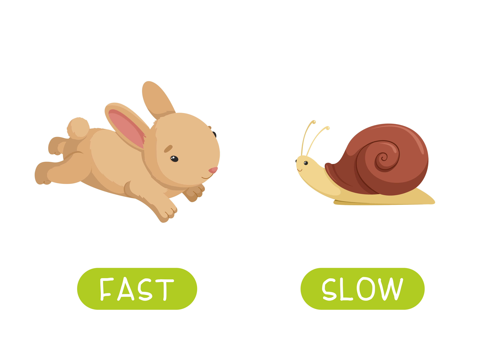

```{r, echo = FALSE}
library(knitr)
opts_chunk$set(comment = "")
```

## Welcome to class!

1.  Introductions
2.  Class overview
3.  Getting R up and running

```{r, fig.alt="Welcome!", out.width = "60%", echo = FALSE, fig.align='center'}
knitr::include_graphics("images/welcome.jpg")
```

<sub>[Photo by <a href="https://unsplash.com/@bel2000a?utm_source=unsplash&utm_medium=referral&utm_content=creditCopyText">Belinda Fewings</a> on <a href="https://unsplash.com/s/photos/welcome?utm_source=unsplash&utm_medium=referral&utm_content=creditCopyText">Unsplash</a>]</sub>

## Before we start ..

Poll: How are you feeling right now?

## About Us

**Carrie Wright (she/her)**

Senior Staff Scientist, Fred Hutchinson Cancer Center

Associate, Department of Biostatistics, JHSPH

PhD in Biomedical Sciences

Email: [cwright2\@fredhutch.org](mailto:cwright2@fredhutch.org){.email} Web: [`https://carriewright11.github.io`](https://carriewright11.github.io)

```{r, fig.alt="Carrie's picture", out.width = "30%", echo = FALSE, fig.align='center'}
knitr::include_graphics(here::here("modules", "Intro", "images", "carrie.png"))
```

## About Us

**Ava Hoffman (she/her)**

Senior Staff Scientist, Fred Hutchinson Cancer Center

Associate, Department of Biostatistics, JHSPH

PhD in Ecology

Email: [ahoffma2\@fredhutch.org](mailto:ahoffma2@fredhutch.org){.email} Web: [`https://avahoffman.com`](https://avahoffman.com)

```{r, fig.alt="Ava's picture", out.width = "30%", echo = FALSE, fig.align='center'}
knitr::include_graphics(here::here("modules", "Intro", "images", "ava.png"))
```

## About Us: TA

**Elizabeth Humphries (she/her)**

Staff Scientist, Fred Hutchinson Cancer Center

PhD in Molecular Epidemiology

Email: [ehumphri\@fredhutch.org](mailto:ehumphri@fredhutch.org){.email}


```{r, fig.alt="Elizabeth's picture", out.width = "30%", echo = FALSE, fig.align='center'}
knitr::include_graphics(here::here("modules", "Intro", "images", "elizabeth.jpg"))
```

## About you!

Please introduce yourself on Slack!

[Slack Workspace](%60r%20config::get(%22slack_workspace%22)%60)

## The Learning Curve

Learning a programming language can be very intense and sometimes overwhelming.

We recommend fully diving in and minimizing other commitments to get the most out of this course.

Like learning a spoken language, programming takes **practice**.

```{r, fig.alt="Sweeping the ocean", out.width = "25%", echo = FALSE, fig.align='center'}
knitr::include_graphics("images/sweeping-the-ocean.gif")
```

## The Learning Curve

Learning R has been career changing for all of us, and we want to share that!

We want you to succeed -- We will get through this together!

```{r, fig.alt="High five", out.width = "25%", echo = FALSE, fig.align='center'}

```

## What is R?

-   R is a language and environment for statistical computing and graphics developed in 1991

-   R is both [open source](https://en.wikipedia.org/wiki/Open_source) and [open development](https://en.wikipedia.org/wiki/Open-source_software_development)

```{r, fig.alt="R logo", out.width = "20%", echo = FALSE, fig.align='center'}
knitr::include_graphics("images/Rlogo.png")
```

<sub>[source: <http://www.r-project.org/>]</sub>

## Why R?

-   Free (open source)

-   High level language designed for statistical computing

-   Powerful and flexible - especially for data wrangling and visualization

-   Extensive add-on software (packages)

-   Strong community

```{r, fig.alt="R-Ladies - a non-profit civil society community", out.width = "20%", echo = FALSE, fig.align='center'}
knitr::include_graphics("https://github.com/rladies/branding-materials/raw/main/logo/R-LadiesGlobal_RBG_online_LogoWithText_Horizontal.png")
```

<sub>[source: <https://github.com/rladies/meetup-presentations_baltimore>]</sub>

## Why not R?

-   Little centralized support, relies on online community and package developers

-   Annoying to update

-   Slower, and more memory intensive, than the more traditional programming languages (C, Perl, Python)

```{r, fig.alt="tortoise and hare", out.width = "40%", echo = FALSE, fig.align='center'}

```

<sub>[[source -School vector created by nizovatina - www.freepik.com](https://www.freepik.com/vectors/school)]</sub>

## Introductions

What do you hope to get out of the class?

Why do you want to use R?

```{r, fig.alt="image of rocks with word hope painted on", out.width = "60%", echo = FALSE, fig.align='center'}
knitr::include_graphics("images/hope.jpg")
```

<sub>[Photo by <a href="https://unsplash.com/@jannerboy62?utm_source=unsplash&utm_medium=referral&utm_content=creditCopyText">Nick Fewings</a> on <a href="https://unsplash.com/s/photos/hope?utm_source=unsplash&utm_medium=referral&utm_content=creditCopyText">Unsplash</a>]</sub>

# Logistics

## Course Website

<https://daseh.org/>

Materials will be uploaded the night before class. We are constantly trying to improve content! Please refresh/download materials before class.

```{r, fig.alt="Data Science for Environmental Public Health course logo", out.width = "60%", echo = FALSE, fig.align='center'}

```

## Learning Objectives

-   Understanding basic programming syntax
-   Reading data into R
-   Recoding and manipulating data
-   Using add-on packages (more on what this is soon!)
-   Making exploratory plots
-   Performing basic statistical tests
-   Writing R functions
-   **Building intuition**

## Course Format

ONLINE VIRTUAL COURSE

-   Lecture with slides, interactive\
-   Lab/Practical experience\
-   Two 10 min breaks each day - timing may vary\
-   Sep 30 - Oct 10, 10:30am - 2:00pm PST on Zoom

## Course Format

IN-PERSON CODE-A-THON

-   Mostly independent group work\
-   Frequent check-ins with instructors and other groups\
-   Some lectures about the practical aspects of coding\
-   Oct 23 - 25 (in person in Seattle)

**Deadline for arranging travel assistance is October 11!**

## Pulse Check Survey

`r config::get("google_survey")`

Let us know anonymously how you're doing with the material.

```{r, fig.alt="Surveys count", out.width = "40%", echo = FALSE, fig.align='center'}

```

<sub>[[source - Banner vector created by pch.vector - www.freepik.com](%22https://www.freepik.com/vectors/banner%22)]</sub>

## Homework

While we do have homework assignments on the course schedule, these are **strictly optional!!!**

We encourage you to try the assignments, as the best way to get comfortable with any programming language is through practice.

## Your Setup

If you can, we suggest working virtually with a **large monitor or two screens**. 

This setup allows you to follow along on Zoom while also doing the hands-on coding.

```{r, fig.alt="Surveys count", out.width = "30%", echo = FALSE, fig.align='center'}
knitr::include_graphics("images/monitors.jpg")
```

<sub>[[source - reddit.com](%22https://www.reddit.com/r/ProgrammerHumor/comments/11ygrjj/deducing_your_personality_from_your_monitor_setup/%22)]</sub>

# Research Survey

## Research Survey

We are collecting data about user experience with our course to learn more about how to improve the data science education experience. This data may ultimately be used for a research publication and reporting to the NIH.

[`https://forms.gle/vxp8vxdN2Ck2j7uY6`](https://forms.gle/vxp8vxdN2Ck2j7uY6)

# Where to find help

## Useful (+ mostly Free) Resources

Found on our website under the `Resources` tab: <https://daseh.org/resources.html>

-   videos from previous offerings of the class
-   cheatsheets for each class

## Help!!!

Error messages can be scary!

-   Check out the FAQ/Help page on the website: <https://daseh.org/help.html>
-   Ask questions in Slack! Copy+pasting your error messages is really helpful!

**We will also dedicate time today to debug any installation issues**

```{r, fig.alt="Muppets hugging it out", out.width = "25%", echo = FALSE, fig.align='center'}
knitr::include_graphics("images/forrest-gump-running.gif")
```

## Using AI

Large Language Models (ChatGPT, Claude, etc.) can be useful for programming. Specifically, it can help with:

* Writing or re-writing (refactoring) your code
* Annotation (code "notes")
* Understanding unfamiliar code

We will talk more about AI + programming during the code-a-thon.

For best practices, we encourage you to check out our [AI for Efficient Programming Course](https://hutchdatascience.org/AI_for_Efficient_Programming).

## Installing R

-   Install the [latest R version](http://cran.r-project.org/) `r config::get("r_version")`

-   [Install RStudio](https://www.rstudio.com/products/rstudio/download/)

-   [R Tools Issue](https://daseh.org/help.html#im-getting-an-error-related-to-something-called-rtools)

More detailed instructions [on the website](https://daseh.org/docs/module_details/day0.html).

RStudio is an **integrated development environment** (IDE) that makes it easier to work with R.

More on that soon!

## Summary

🏠 [Class Website - https://daseh.org/](https://daseh.org/) - Logistics, resources, and help!

📝 [Research Survey - `r config::get("research_survey")`](`r config::get("research_survey")`)

🩺 [Pulse Check - `r config::get("pulsecheck_survey")`](`r config::get("pulsecheck_survey")`)

Image by <a href="https://pixabay.com/users/geralt-9301/?utm_source=link-attribution&amp;utm_medium=referral&amp;utm_campaign=image&amp;utm_content=812226">Gerd Altmann</a> from <a href="https://pixabay.com//?utm_source=link-attribution&amp;utm_medium=referral&amp;utm_campaign=image&amp;utm_content=812226">Pixabay</a>
