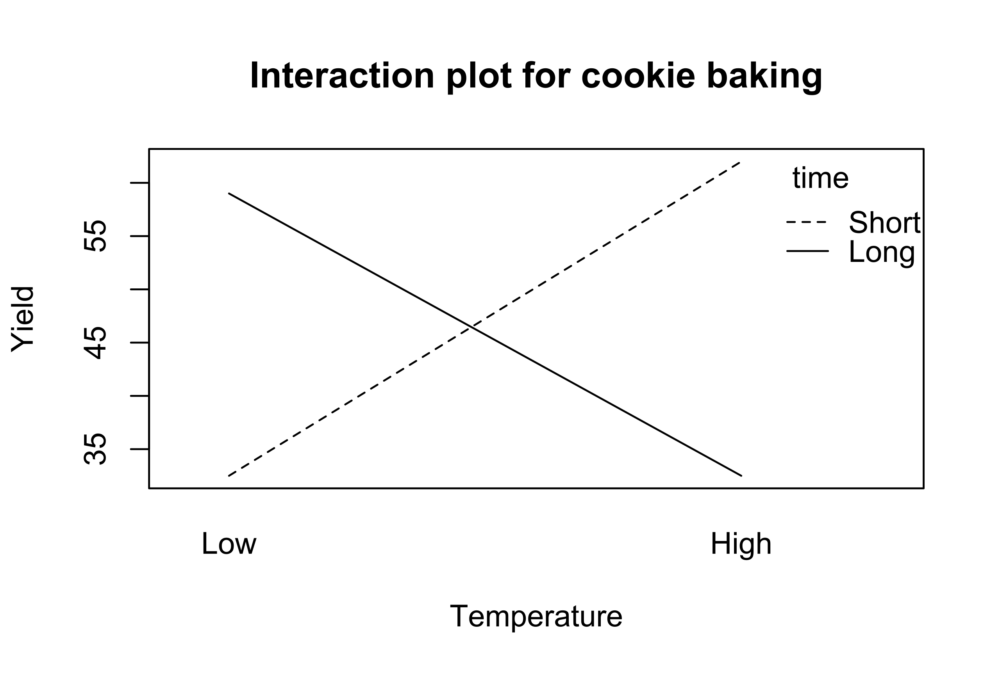

```{r knit-setup, include=FALSE}
library(knitr)
opts_chunk$set(
  echo = TRUE,
  message = FALSE,
  warning = FALSE,
  fig.height = 4,
  fig.width = 7,
  comment = ""
)
library(dplyr)
options(scipen = 999)
library(readr)
library(ggplot2)
library(tidyverse)
```

## Summary

- `ggplot()` specifies what data to use and what variables will be mapped to where
- inside `ggplot()`, `aes(x = , y = , color = )` specify what variables correspond to what aspects of the plot in general
- layers of plots can be combined using the `+` at the **end** of lines
- use `geom_line()` and `geom_point()` to add lines and points
- sometimes you need to add a `group` element to `aes()` if your plot looks strange
- make sure you are plotting what you think you are by checking the numbers!
- `facet_grid(~variable)` and `facet_wrap(~variable)` can be helpful to quickly split up your plot

## Summary

- the factor class allows us to have a different order from alphanumeric for categorical data
- we can change data to be a factor variable using `mutate()`, `as_factor()` (in the `forcats` package), or `factor()` functions and specifying the levels with the `levels` argument
- `fct_reorder({variable_to_reorder}, {variable_to_order_by})` helps us reorder a variable by the values of another variable
- arranging, tabulating, and plotting the data will reflect the new order

## Overview

We will cover how to use R to compute some of basic statistics and fit some basic statistical models.

* Correlation
* T-test
* Linear Regression / Logistic Regression

<br>

##

```{r, fig.alt="I was told there would be no math", out.width = "35%", echo = FALSE, fig.show='hold',fig.align='center'}
knitr::include_graphics("https://c.tenor.com/O3x8ywLm380AAAAd/chevy-chase.gif")
```

## Overview

::: {style="color: red;"}
We will focus on how to use R software to do these. We will be glossing over the statistical **theory** and "formulas" for these tests. Moreover, we do not claim the data we use for demonstration meet **assumptions** of the methods. 
:::

There are plenty of resources online for learning more about these methods.

Check out [www.opencasestudies.org](https://www.opencasestudies.org/) for deeper dives on some of the concepts covered here and the [resource page](https://daseh.org/resources.html) for more resources.

# Correlation

## Correlation

The correlation coefficient is a summary statistic that measures the strength of a linear relationship between two numeric variables.

- The strength of the relationship - based on how well the points form a line
- The direction of the relationship - based on if the points progress upward or downward

```{r, fig.alt="The End", out.width = "90%", echo = FALSE, fig.align='center'}
knitr::include_graphics("https://www.mathsisfun.com/data/images/correlation-examples.svg")
```
[source](https://www.mathsisfun.com/data/correlation.html)

See this [case study](https://www.opencasestudies.org/ocs-bp-co2-emissions/#Data_Analysis) for more information.

## Correlation

Function `cor()` computes correlation in R.

```
cor(x, y = NULL, use = c("everything", "complete.obs"),
    method = c("pearson", "kendall", "spearman"))
```
<br>

- provide two numeric vectors of the same length (arguments `x`, `y`), or  
- provide a data.frame / tibble with numeric columns only  
- by default, Pearson correlation coefficient is computed  

## Correlation test

Function `cor.test()` also computes correlation and tests for association.

```
cor.test(x, y = NULL, alternative(c("two.sided", "less", "greater")),
    method = c("pearson", "kendall", "spearman"))
```
- provide two numeric vectors of the same length (arguments `x`, `y`), or
- provide a data.frame / tibble with numeric columns only
- by default, Pearson correlation coefficient is computed
- alternative values:
   - two.sided means true correlation coefficient is not equal to zero (default)
   - greater means true correlation coefficient is > 0 (positive relationship)
   - less means true correlation coefficient is < 0 (negative relationship)

## GUT CHECK!

What class of data do you need to calculate a correlation?

A. Character data

B. Factor data

C. Numeric data

## Correlation {.codesmall}

Let's look at the dataset of yearly CO2 emissions by country.

```{r cor1, comment="", message = FALSE}
yearly_co2 <- 
  read_csv(file = "https://daseh.org/data/Yearly_CO2_Emissions_1000_tonnes.csv")
```

## Correlation for two vectors

First, we create two vectors.

```{r}
# x and y must be numeric vectors
y1980 <- yearly_co2 %>% pull(`1980`)
y1985 <- yearly_co2 %>% pull(`1985`)
```

<br>

Like other functions, if there are `NA`s, you get `NA` as the result.  But if you specify `use = "complete.obs"`, then it will give you correlation using the non-missing data.

```{r}
cor(y1980, y1985, use = "complete.obs")
```

## Correlation coefficient calculation and test

```{r}
cor.test(y1980, y1985)
```

## Broom package

The `broom` package helps make stats results look tidy

```{r}
library(broom)
cor_result <- tidy(cor.test(y1980, y1985))
glimpse(cor_result)
```

## Correlation for two vectors with plot{.codesmall}

In plot form... `geom_smooth()` and `annotate()` can look very nice!

```{r, warning = F}
corr_value <- pull(cor_result, estimate) %>% round(digits = 4)
cor_label <- paste0("R = ", corr_value)
yearly_co2 %>%
  ggplot(aes(x = `1980`, y = `1985`)) + geom_point(size = 1) + geom_smooth() +
  annotate("text", x = 2000000, y = 4000000, label = cor_label)
```

## Correlation for data frame columns

We can compute correlation for all pairs of columns of a data frame / matrix. This is often called, *"computing a correlation matrix"*.

Columns must be all numeric!

```{r}
co2_subset <- yearly_co2 %>%
  select(c(`1950`, `1980`, `1985`, `2010`))

head(co2_subset)
```

## Correlation for data frame columns

We can compute correlation for all pairs of columns of a data frame / matrix. This is often called, *"computing a correlation matrix"*.

```{r}
cor_mat <- cor(co2_subset, use = "complete.obs")
cor_mat
```

## Correlation for data frame columns with plot

`corrplot` package can make correlation matrix plots

```{r, fig.width=4, fig.height=4}
library(corrplot)
corrplot(cor_mat)
```

## Correlation does not imply causation

```{r, fig.alt="Simpson's paradox!", out.width = "75%", echo = FALSE, fig.align='center'}
knitr::include_graphics(here::here("images/lyme_and_fried_chicken_map.png"))
knitr::include_graphics(here::here("images/lyme_and_fried_chicken.png"))
```

[source](http://doi.org/10.1007/s10393-020-01472-1)


# T-test

## T-test

The commonly used t-tests are:

- **one-sample t-test** -- used to test mean of a variable in one group 
- **two-sample t-test** -- used to test difference in means of a variable between two groups
    - if the "two groups" are data of the *same* individuals collected at 2 time points, we say it is two-sample paired t-test)

The `t.test()` function does both.

```
t.test(x, y = NULL,
       alternative = c("two.sided", "less", "greater"),
       mu = 0, paired = FALSE, var.equal = FALSE,
       conf.level = 0.95, ...)
```

## Running one-sample t-test {.smaller}

It tests the mean of a variable in one group. By default (i.e., without us explicitly specifying values of other arguments):

- tests whether a mean of a variable is equal to 0 (`mu = 0`)
- uses "two sided" alternative (`alternative = "two.sided"`)
- returns result assuming confidence level 0.95 (`conf.level = 0.95`)
- omits `NA` values in data

Let's look at the CO2 emissions data again. 

```{r}
t.test(y1980)
```

## Running two-sample t-test {.small}

It tests the difference in means of a variable between two groups. By default:

- tests whether difference in means of a variable is equal to 0 (`mu = 0`)
- uses "two sided" alternative (`alternative = "two.sided"`)
- returns result assuming confidence level 0.95 (`conf.level = 0.95`)
- assumes data are not paired (`paired = FALSE`)
- assumes true variance in the two groups is not equal (`var.equal = FALSE`)
- omits `NA` values in data

Check out this this [case study](https://www.opencasestudies.org/ocs-bp-rural-and-urban-obesity/#Data_Analysis) and this [case study](https://www.opencasestudies.org/ocs-bp-diet/#Data_Analysis) for more information.

## Running two-sample t-test in R

```{r}
t.test(y1980, y1985)
```

## T-test: retrieving information from the result with `broom` package

The `broom` package has a `tidy()` function that can organize results into a data frame so that they are easily manipulated (or nicely printed)

```{r broom, comment=""}
result <- t.test(y1980, y1985)
result_tidy <- tidy(result)
glimpse(result_tidy)
```

## P-value adjustment {.smaller}

You run an increased risk of Type I errors (a "false positive") when multiple hypotheses are tested simultaneously. 

Use the `p.adjust()` function on a vector of p values. Use `method = ` to specify the adjustment method:

```{r}
my_pvalues <- c(0.049, 0.001, 0.31, 0.00001)
p.adjust(my_pvalues, method = "BH") # Benjamini Hochberg
p.adjust(my_pvalues, method = "bonferroni") # multiply by number of tests
my_pvalues * 4
```

See [here](https://www.nature.com/articles/nbt1209-1135) for more about multiple testing correction. Bonferroni also often done as p value threshold divided by number of tests (0.05/test number).

## Some other statistical tests

- `wilcox.test()` -- Wilcoxon signed rank test, Wilcoxon rank sum test
- `shapiro.test()` -- Test normality assumptions 
- `ks.test()` -- Kolmogorov-Smirnov test
- `var.test()`-- Fisher’s F-Test
- `chisq.test()` -- Chi-squared test
- `aov()` -- Analysis of Variance (ANOVA)

## Summary

- Use `cor()` to calculate correlation between two vectors, `cor.test()` can give more information.
- `corrplot()` is nice for a quick visualization!
- `t.test()` one sample test to test the difference in mean of a single vector from zero (one input)
- `t.test()` two sample test to test the difference in means between two vectors (two inputs)
- `tidy()` in the `broom` package is useful for organizing and saving statistical test output
- Remember to adjust p-values with `p.adjust()` when doing multiple tests on data

## Lab Part 1

🏠 [Class Website](https://daseh.org/)  

💻 [Lab](https://daseh.org/modules/Statistics/lab/Statistics_Lab.Rmd)

# Regression

## Linear regression

Linear regression is a method to model the relationship between a response and one or more explanatory variables.

Most commonly used statistical tests are actually specialized regressions, including the two sample t-test, [see here for more](https://www.opencasestudies.org/ocs-bp-diet/#(t)-test_and_linear_regression).

## Linear regression notation

Here is some of the notation, so it is easier to understand the commands/results.

$$
y_i = \alpha + \beta x_{i} + \varepsilon_i
$$
where:

* $y_i$ is the outcome for person i
* $\alpha$ is the intercept
* $\beta$ is the slope (also called a coefficient) - the mean change in y that we would expect for one unit change in x ("rise over run")
* $x_i$ is the predictor for person i
* $\varepsilon_i$ is the residual variation for person i

## Linear regression

```{r,echo=FALSE}
coefs <- lm(data = iris, Petal.Width ~ Petal.Length) %>% coef()

line_df <- data.frame(x = c(0, 7), y = c(coefs[1], (coefs[2] * 7 + coefs[1])))
riserun_df <- data.frame(x = c(2.1, 2.9, 2.9), y = c((coefs[1] + coefs[2] * 2.1), (coefs[1] + coefs[2] * 2.1), (coefs[1] + coefs[2] * 2.9)))
residual_df <- data.frame(x = c(3, 3), y = c(1.1, (coefs[1] + coefs[2] * 3)))
labels_df <- data.frame(x = c(0.5, 3.2, 2.7), y = c(coefs[1], 0.65, 1), labels = c("alpha", "beta", "epsilon[i]"))

print(ggplot(data = iris, aes(x = Petal.Length, y = Petal.Width)) +
  geom_point() +
  geom_line(data = line_df, aes(x = x, y = y)) +
  geom_point(data = line_df[1, ], aes(x = x, y = y, color = "red", size = 1.5)) +
  geom_line(data = riserun_df, aes(x = x, y = y, color = "orange", size = 1.4)) +
  geom_line(data = residual_df, aes(x = x, y = y, color = "blue", size = 1.4)) +
  geom_label(data = labels_df, aes(x = x, y = y, label = labels, size = 2), parse = TRUE) +
  theme_bw() +
  ylab(expression(y)) +
  xlab(expression(x)) +
  theme(legend.position = "none", text = element_text(size = 20)))
```

## Linear regression {.smaller}

Linear regression is a method to model the relationship between a response and one or more explanatory variables.

We provide a little notation here so some of the commands are easier to put in the proper context.

$$
y_i = \alpha + \beta_1 x_{i1} + \beta_2 x_{i2} + \beta_3 x_{i3} + \varepsilon_i
$$
where:

* $y_i$ is the outcome for person i
* $\alpha$ is the intercept
* $\beta_1$, $\beta_2$, $\beta_2$ are the slopes/coefficients for variables $x_{i1}$, $x_{i2}$, $x_{i3}$ - average difference in y for a unit change (or each value) in x while accounting for other variables
* $x_{i1}$, $x_{i2}$, $x_{i3}$ are the predictors for person i
* $\varepsilon_i$ is the residual variation for person i

See this [case study](https://www.opencasestudies.org/ocs-bp-diet/#Data_Analysis) for more details.

## Linear regression fit in R

To fit regression models in R, we use the function `glm()` (Generalized Linear Model).

You may also see `lm()` which is a more limited function that only allows for normally/Gaussian distributed error terms (aka typical linear regressions).

We typically provide two arguments:

- `formula` -- model formula written using names of columns in our data
- `data` -- our data frame

## Linear regression fit in R: model formula

Model formula
$$
y_i = \alpha + \beta x_{i} + \varepsilon_i
$$
In R translates to

<p style="text-align: center;">
`y ~ x`
</p>

## Linear regression fit in R: model formula

Model formula
$$
y_i = \alpha + \beta x_{i} + \varepsilon_i
$$
In R translates to

<p style="text-align: center;">
`y ~ x`
</p>

In practice, `y` and `x` are replaced with the **names of columns from our data set**.

For example, if we want to fit a regression model where outcome is `income` and predictor is `years_of_education`, our formula would be:

<p style="text-align: center;">
`income ~ years_of_education`
</p>

## Linear regression fit in R: model formula

Model formula
$$
y_i = \alpha + \beta_1 x_{i1} + \beta_2 x_{i2} + \beta_3 x_{i3} + \varepsilon_i
$$
In R translates to

<p style="text-align: center;">
`y ~ x1 + x2 + x3`
</p>

In practice, `y` and `x1`, `x2`, `x3` are replaced with the **names of columns from our data set**.

For example, if we want to fit a regression model where outcome is `income` and predictors are `years_of_education`, `age`, and `location` then our formula would be:

<p style="text-align: center;">
`income ~ years_of_education + age + location`
</p>

## Linear regression example

Let's look variables that might be able to predict the number of heat-related ER visits in Colorado.

We'll use the dataset that has ER visits separated out by age category.

We'll combine this with a new dataset that has some weather information about summer temperatures in Denver, downloaded from [https://www.weather.gov/bou/DenverSummerHeat](https://www.weather.gov/bou/DenverSummerHeat). 

We will use this as a proxy for temperatures for the state of CO as a whole for this example.

## Linear regression example{.codesmall}

```{r}
er <- read_csv(file = "https://daseh.org/data/CO_ER_heat_visits_by_age.csv")

temps <- read_csv(file = "https://daseh.org/data/Denver_heat_data.csv")

er_temps <- full_join(er, temps)
er_temps
```

## Linear regression: model fitting{.codesmall}

For this model, we will use two variables:

- **visits** - number of visits to the ER for heat-related illness
- **highest_temp** - the highest recorded temperature of the summer

```{r}
fit <- glm(visits ~ highest_temp, data = er_temps)
fit
```

## Linear regression: model summary

The `summary()` function returns a list that shows us some more detail

```{r}
summary(fit)
```

## tidy results

The broom package can help us here too!

The estimate is the coefficient or slope.

for every 1 degree increase in the highest temperature, we see 1.134 more heat-related ER visits. The error for this estimate is pretty big at 3.328. This relationship appears to be insignificant with a p value = 0.735.

```{r}
tidy(fit) %>% glimpse()
```

## Linear regression: multiple predictors {.smaller}

Let's try adding another other explanatory variable to our model, year (`year`).

```{r}
fit2 <- glm(visits ~ highest_temp + year, data = er_temps)
summary(fit2)
```

## Linear regression: multiple predictors

Can also use `tidy` and `glimpse` to see the output nicely.

```{r}
fit2 %>%
  tidy() %>%
  glimpse()
```

## Linear regression: factors

Factors get special treatment in regression models - lowest level of the factor is the comparison group, and all other factors are **relative** to its values.

Let's add age category (`age`) as a factor into our model. We'll need to convert it to a factor first.

```{r}
er_temps <- er_temps %>% mutate(age = factor(age))
```


## Linear regression: factors {.smaller}

The comparison group that is not listed is treated as intercept. All other estimates are relative to the intercept. 

```{r regressbaseline, comment="", fig.height=4,fig.width=8}

fit3 <- glm(visits ~ highest_temp + year + age, data = er_temps)
summary(fit3)
```

## Linear regression: factors {.smaller}

Maybe we want to use the age group "65+ years" as our reference. We can relevel the factor.

The ages are relative to the level that is not listed.

```{r}
er_temps <- 
  er_temps %>% 
  mutate(age = factor(age,
    levels = c("65+ years", "35-64 years", "15-34 years", "5-14 years", "0-4 years")
  ))
  
fit4 <- glm(visits ~ highest_temp + year + age, data = er_temps)
summary(fit4)
```

## Linear regression: factors {.smaller}

You can view estimates for the comparison group by removing the intercept in the GLM formula 

`y ~ x - 1`

*Caveat* is that the p-values change, and interpretation is often confusing.

```{r regress9, comment="", fig.height=4, fig.width=8}
fit5 <- glm(visits ~ highest_temp + year + age - 1, data = er_temps)
summary(fit5)
```

## Linear regression: interactions

```{r, fig.alt="Statistical interaction showing the relationship between cookie yield, temperature, and cooking duration.", out.width = "70%", echo = FALSE, fig.align='center'}

```

[source](https://en.wikipedia.org/wiki/Interaction_(statistics)#/media/File:Interaction_plot_cookie_baking.svg)

## Linear regression: interactions {.smaller}

You can also specify interactions between variables in a formula `y ~ x1 + x2 + x1 * x2`. This allows for not only the intercepts between factors to differ, but also the slopes with regard to the interacting variable.

```{r fig.height=4, fig.width=8}
fit6 <- glm(visits ~ highest_temp + year + age + age*highest_temp, data = er_temps
) 
tidy(fit6)
```

## Linear regression: interactions {.smaller}

By default, `ggplot` with a factor added as a color will look include the interaction term. Notice the different intercept and slope of the lines.

```{r fig.height=3.5, fig.width=7, warning=FALSE}
ggplot(er_temps, aes(x = highest_temp, y = visits, color = age)) +
  geom_point(size = 1, alpha = 0.1) +
  geom_smooth(method = "glm", se = FALSE) +
  theme_classic()
```

## Generalized linear models (GLMs)

Generalized linear models (GLMs) allow for fitting regressions for non-continuous/normal outcomes. Examples include: logistic regression, Poisson regression.

Add the `family` argument -- a description of the error distribution and link function to be used in the model. These include:

- `binomial(link = "logit")` - outcome is binary
- `poisson(link = "log")` - outcome is count or rate
- others

Very important to use the right test!

See this [case study](https://www.opencasestudies.org/ocs-bp-vaping-case-study/#Data_Analysis) for more information.

See `?family` documentation for details of family functions.

## Logistic regression {.smaller}

Let's look at a logistic regression example. We'll use the `er_temps` dataset again. 

We will create a new binary variable `high_rate`. We will say a visit rate of more than 8 qualifies as a high visit rate.

```{r}
er_temps <-
  er_temps %>% mutate(high_rate = rate > 8)

glimpse(er_temps)
```


## Logistic regression {.smaller}

Let's explore how `highest_temp`, `year`, and `age` might predict `high_rate`.

```
# General format
glm(y ~ x, data = DATASET_NAME, family = binomial(link = "logit"))
```

```{r regress7, comment="", fig.height=4,fig.width=8}
binom_fit <- glm(high_rate ~ highest_temp + year + age, data = er_temps, family = binomial(link = "logit"))
summary(binom_fit)
```

## Logistic Regression

See this [case study](https://www.opencasestudies.org/ocs-bp-vaping-case-study/#Logistic_regression_%E2%80%9Cby_hand%E2%80%9D_and_by_model) for more information.


## Odds ratios

> An odds ratio (OR) is a measure of association between an exposure and an outcome. The OR represents the odds that an outcome will occur given a particular exposure, compared to the odds of the outcome occurring in the absence of that exposure.

Check out [this paper](https://www.ncbi.nlm.nih.gov/pmc/articles/PMC2938757/).

Use `oddsratio(x, y)` from the `epitools()` package to calculate odds ratios.

## Odds ratios {.smaller}

During the years 2012, 2018, 2021, and 2022, there were multiple consecutive days with temperatures above 100 degrees. We will code this as `heatwave`.

```{r}
library(epitools)

er_temps <-
  er_temps %>%
  mutate(heatwave = year %in% c(2012, 2018, 2021, 2022))

glimpse(er_temps)
```

## Odds ratios {.smaller}

In this case, we're calculating the odds ratio for whether a heatwave is associated with having a visit rate greater than 8. 

```{r}
response <- er_temps %>% pull(high_rate)
predictor <- er_temps %>% pull(heatwave)

oddsratio(predictor, response)
```

## Odds ratios {.smaller}

The Odds Ratio is 3.86.

When the predictor is TRUE (aka it was a heatwave year), the odds of the response (high hospital visitation) are 3.86 times greater than when it is FALSE (not a heatwave year).

```{r echo = FALSE}
oddsratio(predictor, response)
```

## Final note

Some final notes:

- Researcher's responsibility to **understand the statistical method**  they use -- underlying assumptions, correct interpretation of method results

- Researcher's responsibility to **understand the R software**  they use -- meaning of function's arguments and meaning of  function's output elements

## Summary

- `glm()` fits regression models:
     - Use the `formula =` argument to specify the model (e.g., `y ~ x` or `y ~ x1 + x2` using column names)
     - Use `data = ` to indicate the dataset
     - Use `family = ` to do a other regressions like logistic, Poisson and more
     - `summary()` gives useful statistics
- `oddsratio()` from the `epitools` package can calculate odds ratios (outside of logistic regression - which allows more than one explanatory variable)
- this is just the tip of the iceberg!

## Resources (also on the [website](https://daseh.org/resources.html)!)

For more check out:

- [this chapter](https://jhudatascience.org/tidyversecourse/model.html#linear-modeling) on modeling in this tidyverse book  
- [this chart on when to do what test](https://www.scribbr.com/statistics/statistical-tests/)
- [opencasestudies.org](www.opencasestudies.org)

Content for similar topics as this course can also be found on Leanpub.

## Lab Part 2

🏠 [Class Website](https://daseh.org/)  

💻 [Lab](https://daseh.org/modules/Statistics/lab/Statistics_Lab.Rmd)

📃 [Day 8 Cheatsheet](https://daseh.org/modules/cheatsheets/Day-8.pdf)

```{r, fig.alt="The End", out.width = "30%", echo = FALSE, fig.align='center'}
knitr::include_graphics(here::here("images/the-end-g23b994289_1280.jpg"))
```

Image by <a href="https://pixabay.com/users/geralt-9301/?utm_source=link-attribution&amp;utm_medium=referral&amp;utm_campaign=image&amp;utm_content=812226">Gerd Altmann</a> from <a href="https://pixabay.com//?utm_source=link-attribution&amp;utm_medium=referral&amp;utm_campaign=image&amp;utm_content=812226">Pixabay</a>


