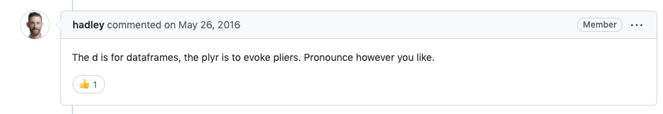
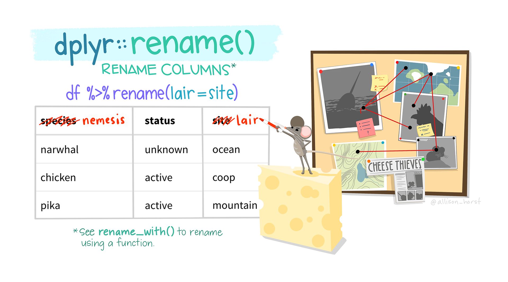
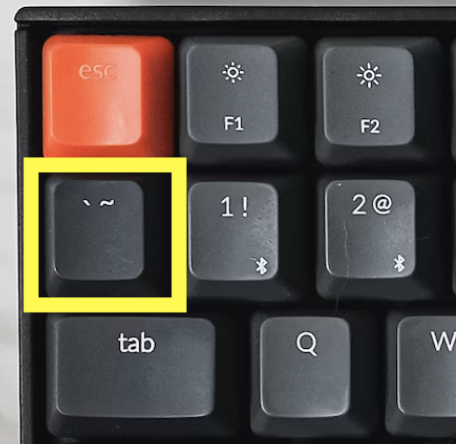
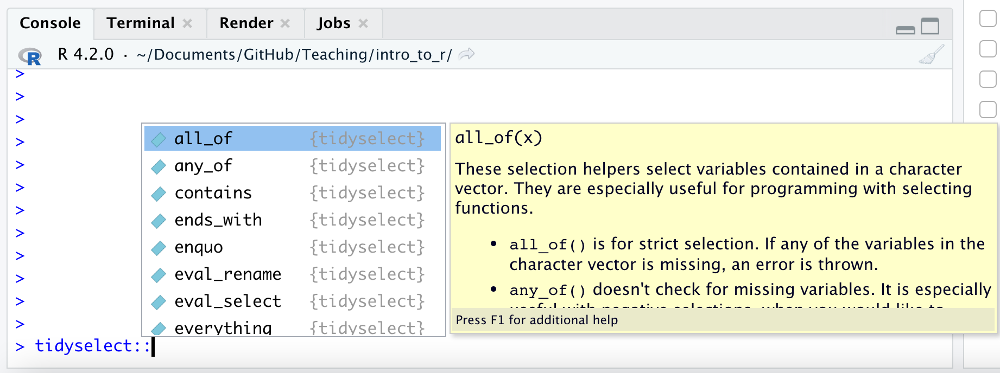

```{r, echo = FALSE}
library(knitr)
opts_chunk$set(comment = "")
suppressPackageStartupMessages(library(dplyr))
library(dplyr)
```

## Reminder

Refresh the website and get the latest version of the labs and slides!
We are constantly making improvements. 

## Recap

- Use `<-` to save (assign) values to objects  
- Use `c()` to **combine** vectors  
- `length()`, `class()`, and `str()` tell you information about an object  
- The sequence `seq()` function helps you create numeric vectors (`from`,`to`, `by`, and `length.out` arguments)  
- The repeat `rep()` function helps you create vectors with the `each` and `times` arguments  
-  Reproducible science makes everyone's life easier!  
- `readr`has helpful functions like `read_csv()` that can help you import data into R  

📃 [Day 2 Cheatsheet](https://daseh.org/modules/cheatsheets/Day-2.pdf)


## Overview

In this module, we will show you how to:

1. Look at your data in different ways
2. Create a data frame and a tibble
3. Create new variables/make rownames a column
4. Rename columns of a data frame
5. Subset rows of a data frame
6. Subset columns of a data frame
7. Add/remove new columns to a data frame
8. Order the columns of a data frame
9. Order the rows of a data frame


## Setup

We will largely focus on the `dplyr` package which is part of the `tidyverse`.

```{r, fig.alt="dplyr", out.width = "25%", echo = FALSE, fig.align='center'}
knitr::include_graphics("https://tidyverse.tidyverse.org/logo.png")
```

Some resources on how to use `dplyr`: 

* https://dplyr.tidyverse.org/
* https://cran.r-project.org/web/packages/dplyr/vignettes/dplyr.html
* https://www.opencasestudies.org/


## Why dplyr?

```{r, fig.alt="dplyr", out.width = "100%", echo = FALSE, fig.align='center'}

```
The `dplyr` package is one of the most helpful packages for altering your data to get it into a form that is useful for creating visualizations, summarizing, or more deeply analyzing. 

So you can imagine using pliers on your data. 

```{r, fig.alt="dplyr", out.width = "20%", echo = FALSE, fig.align='center'}
knitr::include_graphics("https://d33wubrfki0l68.cloudfront.net/621a9c8c5d7b47c4b6d72e8f01f28d14310e8370/193fc/css/images/hex/dplyr.png")
```


## Loading in dplyr and tidyverse

See this website for a list of the packages included in the `tidyverse`: https://www.tidyverse.org/packages/
```{r}
library(tidyverse) # loads dplyr and other packages!
```


## Getting data to work with

We will work with data called `er` about heat-related ER visits between 2011 and 2022, as reported by the state of Colorado, specifically made available by the Colorado Environmental Public Health Tracking program website. Full dataset available at https://coepht.colorado.gov/heat-related-illness.


```{r}
er <- 
  read_csv("https://daseh.org/data/CO_ER_heat_visits.csv")
```


## Checking the data `dim()`

The `dim()`, `nrow()`, and `ncol()` functions are good options to check the dimensions of your data before moving forward.

```{r}
dim(er) # rows, columns
nrow(er) # number of rows
ncol(er) # number of columns
```

## Checking the data: `glimpse()`

In addition to `head()` and `tail()`, the `glimpse()`function of the `dplyr` package  is another great function to look at your data. 

```{r}
glimpse(er)
```
This dataset has information about both the *rate* of ER visits for heat-related illness and the *number of visits*, broken out by both year and CO county.

## Checking your data: `slice_sample()`

What if you want to see the middle of your data? You can use the `slice_sample()` function of the `dplyr` package to see a **random** set of rows. You can specify the number of rows with the `n` argument.

```{r}
slice_sample(er, n = 2)
slice_sample(er, n = 2)

```


# Data frames and tibbles

## Data frames

An older version of data in tables is called a data frame. The mtcars dataset is an example of this. 

```{r}
class(mtcars)
head(mtcars)
```
## tibble

Tibbles are a **fancier** version of data frames:

- We don't have to use head to see a preview of it
- We see the dimensions
- We see the data types for each column

```{r}
er

```


## Creating a `tibble`

If we wanted to create a `tibble` ("fancy" data frame), we can using the  `tibble()` function on a data frame.  

```{r}
tbl_mtcars <- tibble(mtcars) 
tbl_mtcars
```

Note don't necessarily need to use `head()` with tibbles, as they conveniently print a portion of the data.


## Summary of tibbles and data frames

We generally recommend using tibbles, but you are likely to run into lots of data frames with your work. 

Most functions work for both so you don't need to worry about it much!

It can be helpful to convert data frames to tibbles though just to see more about the data more easily. The `tibble()` function helps us do that.

## Data frames vs tibbles - watch out for rownames
 
Note that this conversion can remove row names - which some data frames have.  For example, `mtcars`  (part of R) has row names. In this case we would want to make the rownames a new column first before making into a tibble.

```{r}
head(mtcars, n = 2)
head(tibble(mtcars), n = 2)
```

## rownames_to_column function{.codesmall}

There is a function that specifically helps you do that.

```{r}
head(rownames_to_column(mtcars), n = 2)
head(tibble(rownames_to_column(mtcars)), n = 2)

```


## Data for now

Let's stick with the tibble ER data for our next lesson 

```{r}
head(er)
```


# Renaming Columns

## `rename` function

```{r, fig.alt="dplyr", out.width = "70%", echo = FALSE, fig.align='center'}

```
"Artwork by @allison_horst". https://allisonhorst.com/


## checking names of columns, we can use the `colnames()` function

```{r}
colnames(er)
```

## Renaming Columns of a data frame or tibble

To rename columns in `dplyr`, you can use the `rename` function.

Let's rename lower95CI to lower_95_CI_limit. Notice the new name is listed **first**, similar to how a new object is assigned on the left!

The lower95CI is the lower bound of the estimated rate of ER visits for a particular county and year.

<div class = "codeexample">
```{r, eval = FALSE}
# general format! not code!
{data you are creating or changing} <- rename({data you are using}, 
                                          {New Name} = {Old name})
```
</div>

```{r}
renamed_er<- rename(er, lower_95_CI_limit = lower95cl)
head(renamed_er)
```


## Take Care with Column Names

When you can, avoid spaces, special punctuation, or numbers in column names, as these require special treatment to refer to them. 

See https://daseh.org/resources/quotes_vs_backticks.html for more guidance.

```{r, eval = FALSE}
 # this will cause an error
renamed_er <- rename(er, lower_95%_CI_limit = lower95cl)
```

```{r}
# this will work
renamed_er <- rename(er, `lower_95%_CI_limit` = lower95cl) 
head(renamed_er, 2)
```


## Unusual Column Names

It's best to avoid unusual column names where possible, as things get tricky later.

We just showed the use of \` backticks\` . You may see people use quotes as well.

```{r, fig.alt="dplyr", out.width = "14%", echo = FALSE, fig.align='center'}

```

Other atypical column names are those with:

- spaces
- number without characters
- number starting the name
- other punctuation marks like % (besides "_" or "." and not at the beginning)


## A solution!

Rename tricky column names so that you don't have to deal with them later!

```{r, fig.align='center', echo = FALSE}
include_graphics("https://media.giphy.com/media/6q29hxDKvJvPy/giphy.gif")
```

## Be careful about copy pasting code!

Curly quotes will not work!

```{r, eval = FALSE}
# this will cause an error!
renamed_er <- rename(er, ‘lower_95%_CI_limit’ = lower95cl)
```

```{r, eval = FALSE}
# this will work!
renamed_er <- rename(er, 'lower_95%_CI_limit' = lower95cl)
```

Also true for double quotes
```{r, eval = FALSE}
 # this will cause an error!
renamed_er <- rename(er, “lower_95%_CI_limit” = lower95cl)
```

```{r, eval = FALSE}
# this will work!
renamed_er <- rename(er, "lower_95%_CI_limit" = lower95cl)
```

## Rename multiple columns

A comma can separate different column names to change.

```{r}
renamed_er <- rename(er, 
                        lower_95perc_CI_limit = lower95cl, 
                        upper_95perc_CI_limit = upper95cl)
head(renamed_er, 3)
```

## Renaming all columns of a data frame: dplyr {.codesmall}

To rename all columns you use the `rename_with()`. In this case we will use `toupper()` to make all letters upper case. Could also use `tolower()` function.

```{r}
er_upper <- rename_with(er, toupper)
head(er_upper, 3)
```

```{r}
rename_with(er_upper, tolower)
```

## janitor package

If you need to do lots of naming fixes - look into the janitor package!

```{r, echo = FALSE, message=FALSE, comment= FALSE, warning = FALSE, results='hide'}
install.packages("janitor", repos='http://cran.us.r-project.org')
```

```{r, message=FALSE, warning=FALSE}
#install.packages("janitor")
library(janitor)
```

## janitor `clean_names`

The `clean_names` function can intuit what fixes you might need. 

The yearly_co2_emissions dataset contains estimated CO2 emissions for 265 countries between the years 1751 and 2014.

```{r}
yearly_co2 <- 
  read_csv("https://daseh.org/data/Yearly_CO2_Emissions_1000_tonnes.csv")
```

## yearly_co2 column names

```{r}
head(yearly_co2, n = 2)
```

## janitor `clean_names` can intuit fixes
The `clean_names` function can intuit what fixes you might need. Here it make sure year names aren't just a number, so that the colnames don't need ticks or quotes to be used.

```{r}
clean_names(yearly_co2)
```

## more of clean_names

`clean_names` can also get rid of spaces and replace them with `_`.

```{r}
test <- tibble(`col 1` = c(1,2,3), `col 2` = c(2,3,4))
test
clean_names(test)
```

## GUT CHECK: Which of the following would work well with a column called `counties_of_seattle_with_population_over_10,000`?

A. Renaming it using `rename` function to something simpler like `seattle_counties_over_10thous`.

B. Keeping it as is and use backticks around the column name when you use it.

C. Keeping it as is and use quotes around the column name when you use it.


## Summary

- data frames are simpler version of a data table
- tibbles are fancier `tidyverse` version
- tibbles are made with `tibble()` 
- if your original data has rownames, you need to use `rownames_to_column` before converting to tibble
- the `rename()` function of `dplyr` can help you rename columns
- avoid using punctuation (except underscores), spaces, and numbers (to start or alone) in column names
- if you must do a nonstandard column name - typically use backticks around it. See https://daseh.org/resources/quotes_vs_backticks.html.
- avoid copy and pasting code from other sources - quotation marks will change!
- check out `janitor` if you need to make lots of column name changes

## Lab Part 1

🏠 [Class Website](https://daseh.org/) 

💻 [Lab](https://daseh.org/modules/Subsetting_Data_in_R/lab/Subsetting_Data_in_R_Lab.Rmd) 

📃 [Day 3 Cheatsheet](https://daseh.org/modules/cheatsheets/Day-3.pdf)

📃 [Posit's `dplyr` Cheatsheet](https://rstudio.github.io/cheatsheets/data-transformation.pdf)


# Subsetting Columns

## Let's get our data again

We'll work with the CO heat-related ER visits dataset again.

This time lets also make it a smaller subset so it is easier for us to see the full dataset as we work through examples. 

```{r}
# er<-read_csv("https://daseh.org/data/CO_ER_heat_visits.csv")
set.seed(1234)
er_30 <-slice_sample(er, n = 30)
```

## Subset columns of a data frame - `tidyverse` way: 

To grab a vector version (or "pull" out) the `year` column the `tidyverse` way we can use the `pull` function:

```{r}
pull(er_30, year)
```


## Subset columns of a data frame: dplyr

The `select` command from `dplyr` allows you to subset (still a `tibble`!)

```{r}
select(er_30, year)
```

## GUT CHECK: What function would be useful for getting a vector version of a column?

A. `pull()`

B. `select()`

## Select multiple columns

We can use `select` to select for multiple columns.

```{r}
select(er_30, year, rate, county)
```


## Select columns of a data frame: dplyr

The `select` command from `dplyr` allows you to subset columns matching patterns:

```{r}
head(er_30, 2)
select(er_30, ends_with("cl"))
```

## See the Select "helpers"

Here are a few:

```{r, eval = FALSE}
last_col()
starts_with()
ends_with()
contains()
```

Type `tidyselect::` in the **console** and see what RStudio suggests:

```{r, fig.alt="dplyr", out.width = "70%", echo = FALSE, fig.align='center'}

```

## Combining tidyselect helpers with regular selection

```{r}
head(er_30, 2)
select(er_30, ends_with("cl"), year)
```

## Multiple tidyselect functions

Follows OR logic.

```{r}
select(er_30, ends_with("cl"), starts_with("r"))

```


## The `where()` function can help select columns of a specific class{.codesmall}

`is.character()` and `is.numeric()` are often the most helpful

```{r}
head(er_30, 2)
select(er_30, where(is.numeric))

```


# Subsetting Rows

## `filter` function

```{r, fig.alt="dplyr", out.width = "70%", echo = FALSE, fig.align='center'}
knitr::include_graphics("images/filter.png")
```

"Artwork by @allison_horst". https://allisonhorst.com/

## Subset rows of a data frame: dplyr

The command in `dplyr` for subsetting rows is `filter`.

```{r}
filter(er_30, year > 2020)
```


## Subset rows of a data frame: dplyr

You can have multiple logical conditions using the following:

* `==` : equals to
* `!=`: not equal to (`!` : not/negation)
* `>` / `<`: greater than / less than
* `>=` or `<=`: greater than or equal to / less than or equal to
* `&` : AND
* `|` : OR

## Common error for filter

If you try to filter for a column that does not exist it will not work:
 
 - misspelled column name 
 - column that was already removed 


## Subset rows of a data frame: dplyr {.codesmall}

You can filter by two conditions using `&` or commas (must meet both conditions):

```{r, eval = FALSE}
filter(er_30, rate > 9, year == 2012)
```

```{r}
filter(er_30, rate > 9 & year == 2012) # same result
```

## Subset rows of a data frame: dplyr

If you want OR statements (meaning the data can meet either condition does not need to meet both), you need to use `|` between conditions:

```{r}
filter(er_30, rate > 9 | year == 2012)

```

## Subset rows of a data frame: dplyr {.codesmall}

The `%in%` operator can be used find values from a pre-made list (using `c()`) for a **single column** at a time. 

```{r}
filter(er_30,  county %in% c("Denver","Larimer","Pueblo"))

filter(er_30,  county == "Denver"| county == "Larimer"| county == "Pueblo") #equivalent
```

## Subset rows of a data frame: dplyr {.codesmall}

The `%in%` operator can be used find values from a pre-made list (using `c()`) for a **single column** at a time with different columns.

```{r}
filter(er_30, year %in% c(2013,2021), county %in% c("Denver","Pueblo"))

```

## Be careful with column names and `filter`

This will not work the way you might expect! Best to stick with nothing but the column name if it is a typical name. 

```{r}
filter(er_30, "year" > 2014)
```

## Don't use quotes for atypical names

Atypical names are those with punctuation, spaces, start with a number, or are just a number. 

```{r}
er_30_rename <- rename(er_30, `year!` = year)

filter(er_30_rename, "year!" > 2013) # will not work correctly
```

## Be careful with column names and `filter`

Using backticks works!

```{r}
filter(er_30_rename, `year!` > 2013) 
```


## Be careful with column names and `filter`

```{r}
filter(er_30, "county" == "Denver") # this will not work
```

## Be careful with column names and `filter`

```{r}
filter(er_30, county == "Denver")# this works!
```

## `filter()` is tricky

Try not use anything special for the column names in `filter()`. This is why it is good to not use atypical column names. Then you can just use the column name!


## Always good to check each step!

Did the filter work the way you expected? Did the dimensions change?

```{r, echo = FALSE, fig.align='center'}
knitr::include_graphics("https://media.giphy.com/media/5b5OU7aUekfdSAER5I/giphy.gif")
```
https://media.giphy.com/media/5b5OU7aUekfdSAER5I/giphy.gif


## GUT CHECK: If we want to keep just rows that meet either or two conditions, what code should we use?

A. `filter()` with `|`

B. `filter()` with `&`


## Summary

- `pull()` to get values out of a data frame/tibble
- `select()` is the `tidyverse` way to get a tibble with only certain columns
-  you can `select()` based on patterns in the column names
-  you can also `select()` based on column class with the `where()` function
-  you can combine multiple tidyselect functions together like `select(starts_with("C"), ends_with("state"))`
-  you can combine multiple patterns with the `c()` function like `select(starts_with(c("A", "C")))` (see extra slides at the end for more info!)
- `filter()` can be used to filter out rows based on logical conditions
-  avoid using quotes when referring to column names with `filter()`

## Summary Continued

- `==` is the same as equivalent to
- `&` means both conditions must be met to remain after `filter()`
- `|` means either conditions needs to be met to remain after `filter()`

## Lab Part 2

🏠 [Class Website](https://daseh.org)   

💻 [Lab](https://daseh.org/modules/Subsetting_Data_in_R/lab/Subsetting_Data_in_R_Lab.Rmd)

📃 [Day 3 Cheatsheet](https://daseh.org/modules/cheatsheets/Day-3.pdf)

📃 [Posit's `dplyr` Cheatsheet](https://rstudio.github.io/cheatsheets/data-transformation.pdf)

## Get the data

```{r}

#er <- read_csv("https://daseh.org/data/CO_ER_heat_visits.csv")
set.seed(1234)
er_30 <-slice_sample(er, n = 30)
```

## Combining `filter` and `select`

You can combine `filter` and `select` to subset the rows and columns, respectively, of a data frame:

```{r}
select(filter(er_30, year > 2012), county)
```


## Nesting

In `R`, the common way to perform multiple operations is to wrap functions around each other in a "nested" form.

```{r}
head(select(er_30, year, county), 2)
```

## Nesting can get confusing looking

```{r}
select(filter(er_30, year > 2000 & county == "Denver"), year, rate)
```

## Assigning Temporary Objects

One can also create temporary objects and reassign them:

```{r}
er_30_Den <- filter(er_30, year > 2000 & county == "Denver")
er_30_Den <- select(er_30_Den, year, rate)

head(er_30_Den)
```

## Using the `pipe` (comes with `dplyr`):

The pipe `%>%` makes this much more readable.  It reads left side "pipes" into right side.  RStudio `CMD/Ctrl + Shift + M` shortcut. Pipe `er_30` into `filter`, then pipe that into `select`:


```{r}
er_30 %>% filter(year > 2000 & county == "Denver") %>% select(year, rate)
```

## Alternative Pipes

There are multiple ways to write a pipe and you might see these (they work the same!):

         |>

         %>%

# Adding/Removing Columns


## Adding columns to a data frame: dplyr (`tidyverse` way){.codesmall}

The `mutate` function in `dplyr` allows you to add or modify columns of a data frame.

<div class = "codeexample">
```{r, eval = FALSE}
# General format - Not the code!
{data object to update} <- mutate({data to use}, 
                           {new variable name} = {new variable source}) 
```
</div>

```{r}
er_30 <- mutate(er_30, newcol = rate * 2)
head(er_30, 4)
```


## Use mutate to modify existing columns {.codesmall}

The `mutate` function in `dplyr` allows you to add or modify columns of a data frame.

<div class = "codeexample">
```{r, eval = FALSE}
# General format - Not the code!
{data object to update} <- mutate({data to use}, 
                           {variable name to change} = {variable modification}) 
```
</div>

```{r}
er_30 <- mutate(er_30, newcol = newcol / 2)
head(er_30, 4)
```


## You can pipe data into mutate {.codesmall}


```{r}
er_30 <- er_30 %>% mutate(newcol = newcol / 2)
head(er_30,4)
```

## `mutate` function

```{r, fig.alt="dplyr", out.width = "80%", echo = FALSE, fig.align='center'}
knitr::include_graphics("images/mutate.png")
```
"Artwork by @allison_horst". https://allisonhorst.com/


## Removing columns of a data frame: dplyr {.codesmall}

The `NULL` method is still very common.

The `select` function can remove a column with exclamation mark (`!`) our using the minus sign (`-`):

```{r, eval = FALSE}
select(er_30, !newcol)
```

```{r, echo = FALSE}
head(select(er_30, !newcol))
```

**Or, you can simply select the columns you want to keep, ignoring the ones you want to remove.**

## Removing columns in a data frame: dplyr {.codesmall}

You can use `c()` to list the columns to remove.

Remove `newcol` and `year`:
```{r}
select(er_30, !c(newcol, year))
```


# Ordering columns

## Ordering the columns of a data frame: dplyr 

The `select` function can reorder columns.
```{r}
head(er_30, 2)
er_30 %>% select(year, rate, county) %>%
head(2)
```

## Ordering the columns of a data frame: dplyr {.codesmall}

The `select` function can reorder columns.  Put `newcol` first, then select the rest of columns:
```{r, eval = FALSE}
select(er_30, newcol, everything())
```

```{r, echo = FALSE}
head(select(er_30, newcol, everything()), 3)
```

<!-- ## Ordering the columns of a data frame: dplyr {.codesmall} -->

<!-- Put `year` at the end ("remove, everything, then add back in"): -->

<!-- ```{r, eval = FALSE} -->
<!-- select(er_30, !year, everything(), year) -->
<!-- ``` -->

<!-- ```{r, echo = FALSE} -->
<!-- head(select(er_30, !year, everything(), year), 3) -->
<!-- ``` -->


## Ordering the columns of a data frame: dplyr {.codesmall}

In addition to `select` we can also use the `relocate()` function of dplyr to rearrange the columns for more complicated moves with the `.before` and `.after` arguments.

For example, let say we just wanted `year` to be before `rate``.

```{r}

head(er_30, 1)

er_year_fix <- relocate(er_30, year, .before = rate)

head(er_year_fix, 1)
```


# Ordering rows

## Ordering the rows of a data frame: dplyr

The `arrange` function can reorder rows  By default, `arrange` orders in increasing order:
```{r}
arrange(er_30, year)
```

## Ordering the rows of a data frame: dplyr

Use the `desc` to arrange the rows in descending order:
```{r}
arrange(er_30, desc(year))
```

## Ordering the rows of a data frame: dplyr

You can combine increasing and decreasing orderings:
```{r}
arrange(er_30, rate, desc(year)) %>% head(n = 2)

arrange(er_30, desc(year), rate) %>% head(n = 2)
```

## GUT CHECK: What function would be useful for changing a column to be a percentage instead of a ratio?

A. `filter()`

B. `select()`

C. `mutate()`


## GUT CHECK: How would we interpret `er_30 %>% filter(year > 2020) %>% select(year, rate)`?

A. Get the `er_30` data, then filter it for rows with `year` values over 2020, then select only the `year` and `rate` columns.

B. Get the `er_30` data, then filter it rows with `year` values over 2020, then select for rows that have values for `year` and `rate`.


## Summary

- `select()` and `filter()` can be combined together
- you can do sequential steps in a few ways:
    1. nesting them inside one another using parentheses `()`
    2. creating intermediate data objects in between
    3. using pipes `%>%` (like "then" statements)
- `select()` and `relocate()` can be used to reorder columns
- `arrange()` can be used to reorder rows
- can remove rows with `filter()`
- can remove a column in a few ways:  
    2. using `select()` with exclamation mark in front of column name(s)  
    3. not selecting it (without exclamation mark)  

## Summary cont...

- `mutate()` can be used to create new variables or modify them

<div class = "codeexample">
```{r, eval = FALSE}
# General format - Not the code!
{data object to update} <- mutate({data to use}, 
                                {new variable name} = {new variable source}) 
```
</div>

```{r, eval = FALSE}
er_30 <- mutate(ER_30, newcol = count/2.2)
```

## A note about base R: 

The `$` operator is similar to `pull()`. This is the base R way to do this:

```{r}
er_30$year
```

Although it is easier (for this one task), mixing and matching the `$` operator with tidyverse functions usually doesn't work. Therefore, we want to let you know about it in case you see it, but we suggest that you try working with the tidyverse way.

## Adding new columns to a data frame: base R

You can add a new column (or modify an existing one) using the `$` operator instead of `mutate`.

Just want you to be aware of this as it is very common.

```{r}
er_30$newcol <- er_30$rate/2.2
head(er_30,3)
```

Even though `$` is easier for creating new columns, `mutate` is really powerful, so it's worth getting used to.

## Lab Part 3

🏠 [Class Website](https://daseh.org)

💻 [Lab](https://daseh.org/modules/Subsetting_Data_in_R/lab/Subsetting_Data_in_R_Lab.Rmd)

📃 [Day 3 Cheatsheet](https://daseh.org/modules/cheatsheets/Day-3.pdf)

📃 [Posit's `dplyr` Cheatsheet](https://rstudio.github.io/cheatsheets/data-transformation.pdf)


```{r, fig.alt="The End", out.width = "50%", echo = FALSE, fig.align='center'}
knitr::include_graphics(here::here("images/the-end-g23b994289_1280.jpg"))
```

Image by <a href="https://pixabay.com/users/geralt-9301/?utm_source=link-attribution&amp;utm_medium=referral&amp;utm_campaign=image&amp;utm_content=812226">Gerd Altmann</a> from <a href="https://pixabay.com//?utm_source=link-attribution&amp;utm_medium=referral&amp;utm_campaign=image&amp;utm_content=812226">Pixabay</a>

# Extra Slides

## Multiple patterns with tidyselect

Need to combine the patterns with the `c()` function.

```{r}
select(er_30, ends_with("cl"), starts_with("r"))
select(er_30, starts_with(c("r", "l"))) # here we combine two patterns

```

## Ordering the column names of a data frame: alphabetically {.codesmall}

Using the base R `order()` function.

```{r}
order(colnames(er_30))
er_30 %>% select(order(colnames(er_30)))
```

## `which()` function

Instead of removing rows like filter, `which()` simply shows where the values occur if they pass a specific condition. We will see that this can be helpful later when we want to select and filter in more complicated ways.

```{r}
which(select(er_30, year) == 2012)
select(er_30, year) == 2012 %>% head(10)
```

## Remove a column in base R

```{r, eval = FALSE}
er_30$year <- NULL
```

## Renaming Columns of a data frame: base R

We can use the `colnames` function to extract and/or directly reassign column names of `df`:

```{r}
colnames(er_30) # just prints
colnames(er_30)[1:2] <- c("County", "Rate") # reassigns
head(er_30)
```

## Subset rows of a data frame with indices: 

Let's select **rows** 1 and 3 from `df` using brackets:

```{r}
er_30[ c(1, 3), ]
```

## Subset columns of a data frame: 

We can also subset a data frame using the bracket `[, ]` subsetting. 

For data frames and matrices (2-dimensional objects), the brackets are `[rows, columns]` subsetting.  We can grab the `x` column using the index of the column or the column name ("`year`") 

```{r}
er_30[, 6]
er_30[, "year"]
```

## Subset columns of a data frame: 

We can select multiple columns using multiple column names:

```{r}
er_30[, c("County", "Rate")]

```


